# Shift Work — Phase 5B Part 2B: Plan B ("Grows Outward") in greybox (report)

Branch `claude/phase-5b-2b-plan-b`, off `main` at `95a2fa3` (Part 2A, PR
#39, confirmed merged with `git log --merges` before starting).

**In one paragraph.** (pending)

---

## 1. What was built

### The store

```
  y 0 ┌──────────────┬────────┬──────────────────────┐
      │ BREAK ROOM   │ STAFF  │ STORAGE (back room)  │  back of house:
      │ (unchanged)  │ HALL   │ dock on the east wall│  no shoppers
  540 ├────────┬─────┴─door───┴──┬─back door─┬───────┤
      │ BAKERY │  DRY GOODS      │  PRODUCE  wing    │
      │ wing 4 │  (the starter   │  (wing 2)         │
 1080 ├─open───┤   corner shop)  │  forklift lane    │
      │ DAIRY/ │                 │  runs north–south │
      │ FROZEN ├─────────────────┤                   │
      │ wing 3 │  CHECKOUT (hub) │                   │
 1680 └────────┴──────door───────┴───────────────────┘
        SIDEWALK + parking (shoppers arrive and leave by the door)
 1860   x 0     780            1620               2400
```

- **World 2400 × 1860** (was 2880 × 1620). The break room is exactly where
  it was; Storage moved as one block to the back-right (`STORAGE_ORIGIN`
  (1440, 0), every back-room number relative to it); a **staff hall**
  joins them and opens into the shop through a 200 px **staff door**.
- **The starter shop** (x 780–1620) is Dry Goods — two gondolas (two
  shelves back to back each) and a two-shelf run on the back wall — and
  the **checkout**, 5 lanes along the front whose **queues run north into
  the store**. The **front door** (200 px) is at its front-right corner.
- **Produce** (wing 2, east, 780 × 1140): a three-shelf run on the outside
  wall, a two-shelf row facing it, the **forklift lane north–south**
  between them, the sample table on the lane and the sale bin; its pad by
  its **own back door into Storage** (a roller shutter until bought).
- **Dairy/Frozen** (wing 3, south-west, 780 × 600): a three-shelf cooler
  run on the outside wall and a two-shelf island.
- **Bakery** (wing 4, north-west corner, 780 × 540): four shelves on the
  back wall and one on the outside wall; open to the shop **and** to the
  Dairy wing (a 240 px opening).
- Same totals as before: **21 shelves (6/5/5/5), 5 registers (2/3/4/5 open
  by tier), 5 trash cans in save order, 4 pads, the dumpster, the
  delivery forklift's lane, the truck, the Staff Board in the Break Room.**

**Where it lives.** `physics-sync-test/StoreLayout.gd` holds all of it:
rooms (with their open/closed rules, links, the manager's stops, spawn and
helper bands), **the walls and the knock-out barriers** (new this part:
Main.gd builds them from the table at start-up — nothing structural is
hand-placed in `Main.tscn` any more, so the table and the walls can't
drift), pads, cans, anchors and the checkout. `Main.tscn` keeps the scene
instances (21 shelves, 5 registers, 2 displays, labels, floor polygons) and
the guard test `areas-snapshot` checks every one against the table.

### Growth stages (screenshots: section 1.1)

| Stage | Owned | What's there |
|---|---|---|
| 1 (a new game) | Dry Goods | The corner shop and the back of house. Three **empty lots** (gravel, a construction fence, a FOR SALE board with the price) behind the shop's outside walls, which carry **FOR SALE banners**. 2 lanes open. |
| 2 | + Produce ($600) | The shop's east wall comes down; the Produce wing and its back door to Storage are open. The Produce forklift starts its north–south laps. 3 lanes. |
| 3 | + Dairy/Frozen ($2,500) | The shop's west wall (front half) comes down. 4 lanes. |
| 4 | + Bakery ($6,000) | The west wall's back half and the Dairy wing's opening into Bakery come down. 5 lanes. |

**The moment.** Buying a section (prep only, at the wall, as before) plays
a 1.8 s greybox knock-out on every connected peer: the wall shakes,
breaks into ~60 px chunks that tumble into the new wing with dust puffs,
and the lot fades to show the wing behind it (`StoreGrowth.gd`, driven by
the registry's `area_opened` hook). A peer that joins later, a reloaded
save or the end of the practice shift just shows the grown store.

**Replication.** Unchanged in kind: the host decides (`buy_section()`,
purchase by RPC with the host checking the buyer stands at the wall), the
replicated `sections_owned` opens the barriers on every peer
(`_configure_gates()`), and the knock-out plays only for a purchase the
host announced. No new network state; **no save change (still v6)**.

### 1.1 Screenshots (final code, `docs/store-layout-plan-b/`)

Whole store at each growth stage (stocked, 25 s into selling; zoom 0.5):

| Stage 1: the corner shop | Stage 2: + Produce |
|---|---|
| 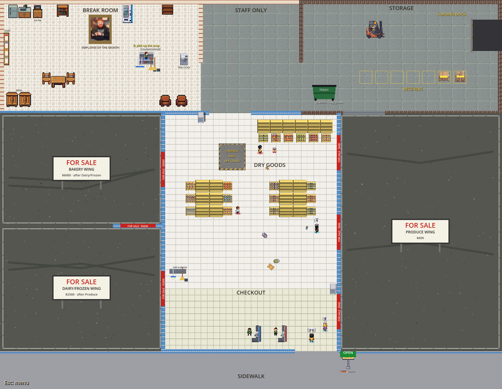 | 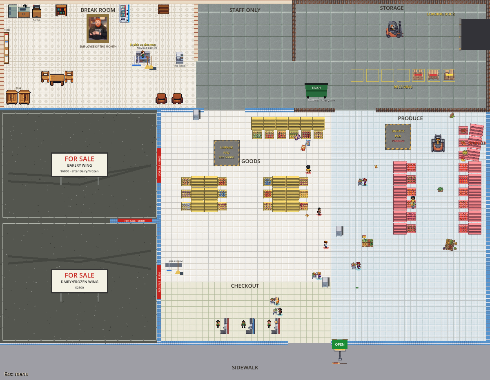 |
| **Stage 3: + Dairy/Frozen** | **Stage 4: + Bakery (the whole store)** |
| 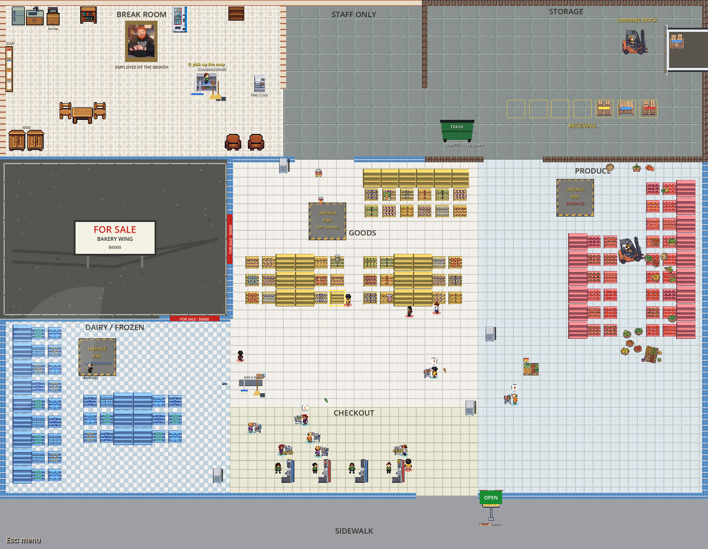 | 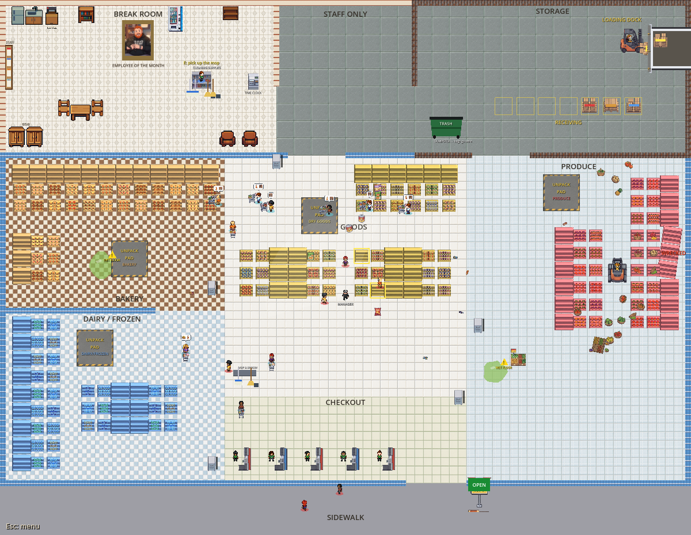 |

A player's view (960 × 540) in each new wing: 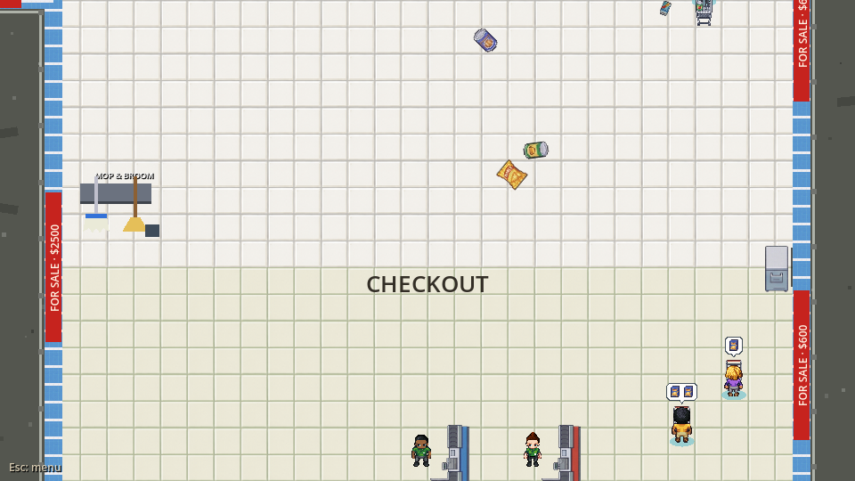
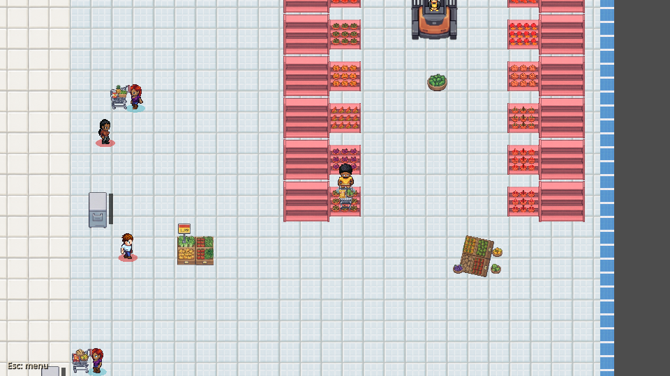 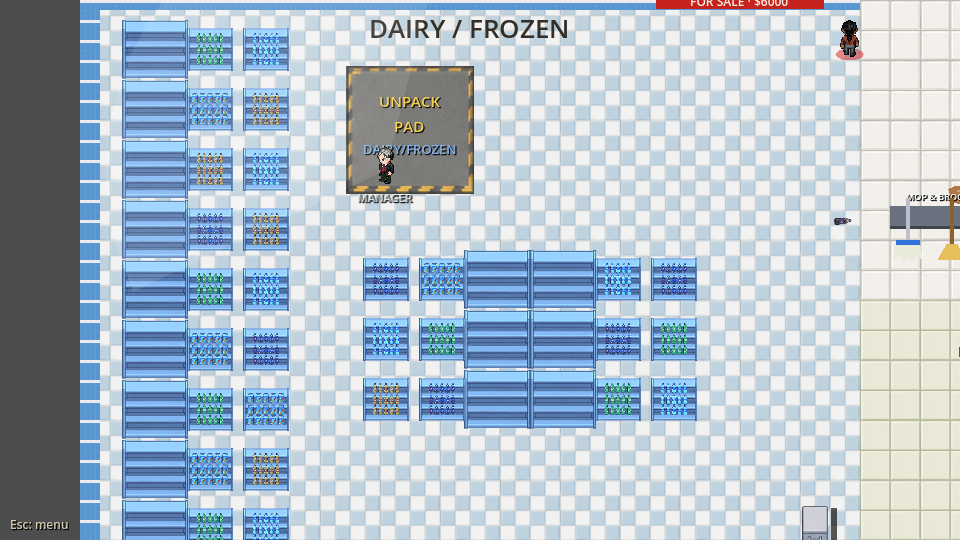
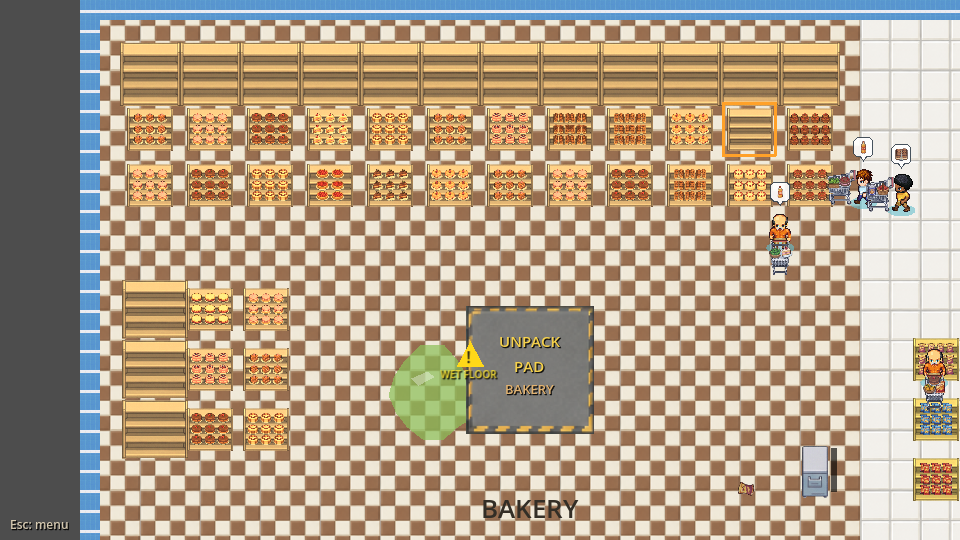

The knock-out (Produce, 0.05 / 0.3 / 0.7 / 1.1 / 2.4 s after the purchase):
 
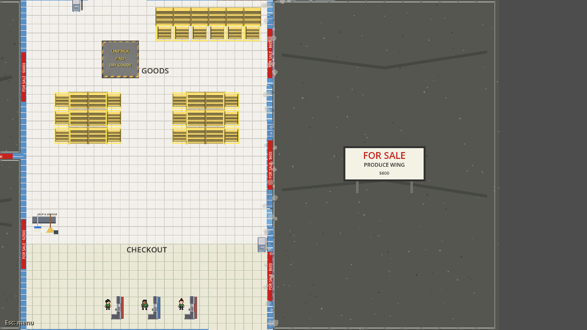 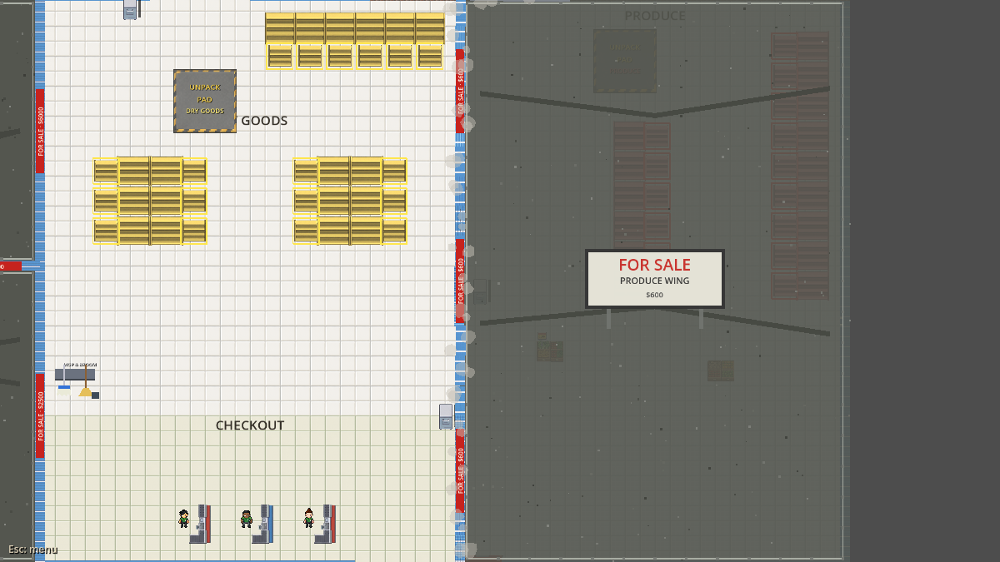
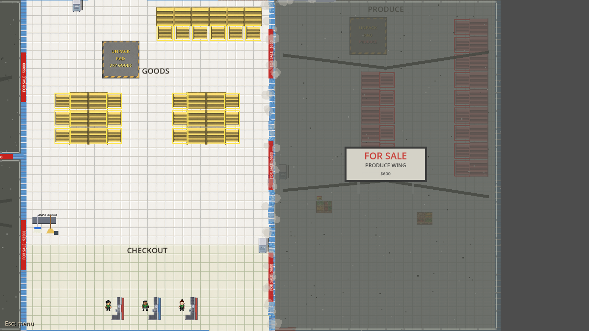. Dairy/Frozen and Bakery mid-knock-out:
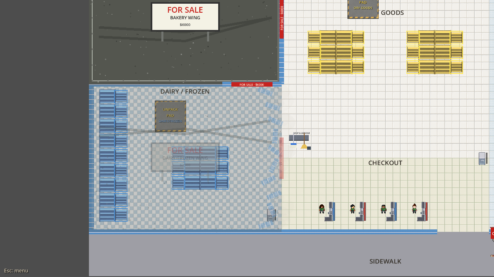 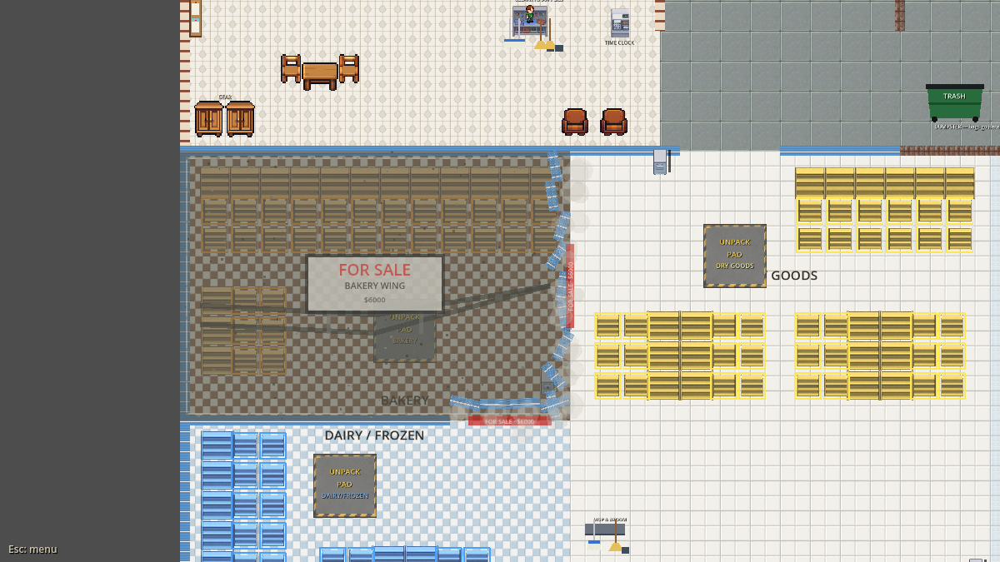

The clip test (host + 2 clients, every helper hired, a selling crowd, an
event running, the host's camera with the HUD): `clip_d1_*` (stage 1),
`clip_d3_*` (stage 2, Lunch Rush), `clip_d5_*` (stage 3, Leaky Roof),
`clip_d7_*` (stage 4, Surprise Delivery; three views).

Storage and the Break Room, main vs Plan B (`tools/layout_proof.gd`):
`proof_storage_main.png` / `proof_storage_branch.png`,
`proof_breakroom_main.png` / `proof_breakroom_branch.png`. The interiors are
pixel-identical (forklift, dock, receiving row, dumpster, every break-room
fixture); the only differences are in the walls (the doorways into the
staff hall, and Produce's roller shutter on Storage's south wall) and the
STORAGE label, 10 px higher.

## 2. Deviations from the proposal, and why

The proposal's Plan B (`docs/store-layout-proposal.md` §3, the diagrams
from `layout_model.py`) was followed in shape: corner shop with the
checkout along the front and the door at its front-right corner, Produce to
the right with its own back door, Dairy/Frozen then Bakery to the left,
back of house along the whole back, nothing ever moves. Every change to the
exact shapes, and why:

| # | Proposal | Built | Why |
|---|---|---|---|
| 1 | World 2400 × 1740; sales floor ~1000 px deep | **2400 × 1860; sales floor 1140 deep** (y 540–1680) | Bakery's wing in the model (740 × 380) had no ~300 × 300 patch for its unpack pad clear of its shelves' slots, and three cooler shelves didn't fit Dairy's outside wall. 120 px more depth fixes both. Open floor rises a little above the proposal's 93 % of today's. |
| 2 | Bakery 740 × 380, Dairy 740 × 600 | **Bakery 780 × 540, Dairy 780 × 600** | Same reason. The 240 px Bakery↔Dairy opening is kept. |
| 3 | The Bakery↔Dairy opening left open (the model had no barrier there) | **A Bakery barrier piece across it** | Dairy/Frozen is bought before Bakery, so with Dairy open the opening would have let shoppers into the unbought Bakery lot. Several barrier pieces per section is the "barrier segments" step the proposal planned. |
| 4 | Bakery: 3 shelves on the back wall + 1 on the outer wall + 1 on the wall facing the shop | **4 on the back wall + 1 on the outer wall** | The shop-facing one would have stood with its back to the knock-out wall, i.e. to open floor once Bakery is bought. |
| 5 | Registers at x 840–1440, 150 apart | **x 850–1350, 125 apart; lane 1 (first to open) nearest the door** | At 150 apart the fifth counter stood in the 200 px door. 125 leaves a 64 px walk-through between a counter and the next lane's cashier. |
| 6 | Dry Goods pad between the gondolas (1200, 1060) | **(1110, 750), in the shop's north end inside the staff door** | Between the gondolas its spill ring (80–150 px) landed on their slot rows. Two other spots were built and measured first: south of the gondolas (1200, 1230), where the income harness showed shelving walks 21 % longer than main's, and the aisle mouths (1200, 1100), where the north-running checkout queues reached the pad at 3+ sections and Dry Goods ran dry while selling (section 5). |
| 7 | Gondola centre y 900 | **y 950** | Leaves a 90 px cross-aisle under the back-wall shelves' standing spots (the model's was ~50 px). |
| 8 | Gondola end caps | **Not built** | The proposal flagged their mouths as stuck-point risks; nothing in the game needs them. Listed for the art pass (B16). |
| 9 | Produce: 2 shelves on its west row at y 760 / 1000; pad at (2160, 1420) | **West row at y 880 / 1060 (level with the east row's); pad at (1950, 670), the dead-end north end of the strip both rows face** | The forklift's lap visits "stations" along its lane; aligned rows give it the old pattern (stations with a shelf on each side). The pad: first built by the back door (1790, 700) for a short carry from Storage, but the progression sim showed the Produce helper walking round its west row for most units and the wing running a third emptier than the old room (section 5). At (1950, 670) every slot faces it and its spill ring stays off the forklift lane. |
| 9b | Dairy/Frozen pad (not placed in the proposal) | **(330, 1210), at the head of the aisle between the wall run and the island** | First built east of the island (620, 1190); same finding and fix as Produce's. |
| 10 | Staff door 1000–1120, "widen to 200 in Part 2" | **200 px (1000–1200)** | As the proposal asked. Break room ↔ hall and hall ↔ Storage doorways are 230 px. |
| 11 | The shop's tool rack (not placed in the proposal) | **Free-standing on the shop's west side, south of the aisles (850, 1300)** | First placed by the staff door; the upkeep tests showed fetching the broom then lost to sweeping by hand (the rack was ~990 px from the checkout's mess, vs ~540 in the old hub). Moved back to ~540. |
| 12 | Manager "lookouts per wing" | **Every room's waypoint and lookouts are in the table**, his checkout stop (and start) inside the door | He walks straight lines with no collision; the old centre-to-centre legs would cross Plan B's shelves. `growth_test` ray-checks every leg. |
| 13 | Spill/stock bands "per area" | **Each wing's band is open floor chosen in the table**; Produce's spans the wing's south half across the lane | A first, narrow Produce band put a Leaky Roof's leaks close together and the janitor alone finished it (the event is meant to need the crew). |

**Nothing in the plan had to be abandoned.** No stuck-AI problem needed a
different room shape: every stage's nav grids have every open slot
reachable, no closed lot reachable and no cut-off pocket of floor
(`growth_test`), and the shopper traffic test has 0 stuck shoppers.

## 3. Systems changed

Most systems needed **no code change**: they already read the layout
table through the registry (2A's work), so Plan B's rooms, anchors, pads,
cans, spawn bands and checkout reached them by data. That covers customers
and their nav grid, the janitor, events (rush, leaky roof, delivery,
catering, brownout), rating, lockers, the tutorial and practice shift,
pause and the HUD. The nav grids are rebuilt per stage from the live walls
and barriers, as before. What did change:

| System | Change | Why |
|---|---|---|
| **Walls and barriers** (`Main.gd`, `Gate.gd`, `Main.tscn`) | Built from the table at start-up (`_build_structure()`): 12 wall segments, 5 barrier pieces (`Gate.tscn` with `setup(section, length, back_door)`). Gates are matched by the section they name (`gates_of()`), not by node name. A section can have several pieces. A back door doesn't sell its section. | Plan B's knock-out walls are segments, not whole room edges (2A's "barrier segments" step). With the structure in the table, the walls and the table can't drift apart. |
| **Growth look** (`StoreGrowth.gd`, new) | The lots, FOR SALE boards and banners, the roller shutter, and the 1.8 s knock-out. Cosmetic, on every peer, driven by `area_opened`. The knock-out plays only inside a 1.5 s window after the host's purchase announcement (`note_purchase()`); otherwise the wing just opens. | Only the purchase moment animates: a late joiner, a reload or the end of practice shows the grown store. |
| **Checkout** (`Cashier.gd`, `Main.tscn`) | The counters are turned −90° so queues run north (the queue markers turn with the body). The cashier is counter-rotated to stay upright and faces the belt. | 2A risk 5: north-facing queues. The queue code already followed the markers. |
| **Forklift** (`Forklift.gd`) | `_build_lap()` works on either axis: along/across the lane's long side, home at either end. | 2A risk 5. The old east–west lap is the same code with along = x (the `fk-*` tests check it). |
| **Helpers** (`Helper.gd`) | The forklift-escape band is a world `Rect2` from the table (`helper_band_of`), not a y range. `_mark_walls()` marks only the real walls and still-closed barriers, not the room's whole edge. | 2A risk 2: in an open wing the old rule walled off the open side, so slots by it were unreachable. |
| **Manager** (`Manager.gd`) | Walks room waypoints and per-room lookouts from the table, not room centres and a computed depth. | He walks straight, through nothing. Plan B's centre-to-centre legs crossed shelves, and `growth_test` G-mgr ray-checks every leg. |
| **Registry** (`Areas.gd`) | `waypoint_of`, `lookouts_of`, `helper_band_of`, `wall_rects`, `barriers`, `segment_rect`. The snapshot covers them. | The table's new fields. |
| **Floor art** (`StoreArt.gd`) | `StaffHallBg` floor; `market_wall_face()` for the knock-out walls. | New room; the walls reuse the sales-floor face. |
| **Income bot** (`tools/bot_nav.gd`, `hazards_test.gd`) | The harness player walks an A* path on a grid of the live store (walls, barriers, shelves, registers, displays) instead of the hand-written room graph (`route_next()` removed). | 2A risk 4: a second, hand-kept copy of the store's connectivity. To compare fairly, main was measured with the **same** bot (worktree `sw-main-nb`: clean main + this bot). |
| **Tests** | About 209 room-relative spots now go through `tools/spots.gd` (`area_spot(room, offset)` from each room's reference point, clamped into open floor). Raw coordinates in hazards, upkeep, sound, janitor, character, phase5, playtest and juice tests were converted. `growth_test.gd` is new: growth, net-growth, checkout, events, demo-path, growth-save 1–3. | Room-relative tests on a new map; the new stage coverage the brief asked for. |

**Save format: unchanged (v6).** A save stores `sections_owned`, cans by
index (the same 5, in the same order) and positions only for things that
are re-placed on load. `growth-save` phase 3 loads a v6 save written by
the Part 2A code: every bought section is open in the new store and its
cans are kept.

## 4. Camera and readability

**Decision: no camera change.** Each player keeps their own camera,
following them at zoom 1 and limited to the whole world (`Player.gd`, limits
from `StoreLayout.WORLD`). The window stays 960 × 540 with `canvas_items`
stretch, so fullscreen shows the same 960 × 540 world area, larger.

Why, from the clip shots (host + 2 clients, a selling crowd on stocked
shelves, every helper hired, an event running, the host's own camera with
the HUD on, at every growth stage):

- **Stage 1 (the corner shop):** the shop is 840 px wide, so one view
  holds its whole width — the checkout, the aisles' south ends and both
  outside walls with their FOR SALE banners. This is the best early
  readability the store has had: three players and the crowd in one
  frame.
- **Stages 2–4:** a view holds about one wing, the same as one old room
  did. Players, shoppers with carts and list bubbles, helpers (name tags),
  the manager's cone, the forklift and spills all read at 960 × 540, as
  they did. Events are still announced by the HUD banner, whatever a
  player is looking at.
- **Zooming out was rejected** for the reason the proposal rejected Plan C:
  at ~0.5 the art and text are too small at 960 × 540. Nothing in Plan B
  needs it — the biggest store (2400 × 1140 of sales floor) is smaller
  than the old one's (2880 × 1080 of rooms).
- **The camera can see the unbought lots** (limits are the world, not the
  open store): the lots advertise what's next, and the knock-out happens
  on screen for anyone near.

(Screenshots: section 1.1, `docs/store-layout-plan-b/shot_clip_*`.)

## 5. Balance: before / after

**How it was measured.** Both harnesses were run on this branch and on
clean main **with the same test bot**. Part 2B moved the bot from a
hand-written room graph onto a nav grid of the live store (section 3), so
main was re-measured with that bot too (`sw-main-nb`: clean main + the new
bot). With the old bot, clean main reproduced Phase 5's solo milestones
exactly (Produce 3, all sections 11, top tier 16, everything 24), and the
new bot on main lands within a shift of them, so the bot change itself is
small.

### 5.1 What was tuned (layout data only; no prices, no Pacing.gd change)

Every change is a pad position in `StoreLayout.PADS`; nothing else in the
economy moved.

| Pad | First built | Final | Why (measured) |
|---|---|---|---|
| Dry Goods (crew-stocked) | (1200, 1230) south of the gondolas | **(1110, 750)**, inside the staff door | (1200, 1230): shelving walks +21 % on main's, day-1 pay −12 %. Then (1200, 1100) at the aisle mouths: the north-running checkout queues reached it at 3+ sections and Dry Goods ran dry while selling. Final: box + 6 units 4,885 px a box (main 4,911). |
| Produce (helper) | (1790, 700) by the back door | **(1950, 670)**, north end of the strip both rows face | Helper round trip pad→slot→pad 969 px vs main's 635; the wing ran a third emptier at 3 sections. Final 717 px (spill ring kept off the forklift lane). |
| Dairy/Frozen (helper) | (620, 1190) east of the island | **(330, 1210)**, head of the wall aisle | 892 px vs main's 610; final 556 px. |
| Bakery (helper) | (450, 900) | unchanged | 587 px (main 610). |

### 5.2 Income harness (`staff_test --test=income`, pay per shift, mean)

| Config | Main (same bot) | Plan B, final | Change |
|---|---|---|---|
| Solo, day 1 (Dry Goods only) | $401 (n 12) | $408 (n 12) | +2 % |
| Solo, day 3 (+ Produce helper) | $911 (n 12) | $916 (n 9) | +1 % |
| Solo, day 7 (all 4, every helper + janitor) | $728 (n 12) | $622 (n 12) | **−15 %** |
| 2 players, day 1 | $582 (n 6) | $581 (n 6) | 0 % |
| 2 players, day 3 | $844 (n 6) | $915 (n 6) | +8 % |
| 2 players, day 7 | $703 (n 3; one $3,118 shift excluded, the client bot opened at 125 s) | $613 (n 4) | **−13 %** |

With the first pads, solo day 1 was $351 (−12 %, first runs) and solo day 7
$593 (−19 %, n 3).

**Why the full store earns less.** Helpers now stock as fast as in the old
rooms (they place the same units per shift and walk within ~25 %). What's
left is the shoppers. A Plan B shopper's walk (door → shelf → register,
averaged over every slot) is **11 % longer over the whole store, 13 % at
three sections**. The checkout is in the corner shop and the wings are off
to its sides, where the old hub sat in the middle. The worst legs are
Produce's shelves → the registers (+42 %) and the door → Dairy (+30 %).
The day-7 harness opens at the prep ceiling (96 s of selling), where that
walk costs most. Moving Produce's shelf block 300 px south saved only 3 %
and wasn't done.

### 5.3 Progression sim (`--test=progress`, typical crew, events on, event-aware bot)

"At shift N" = true at the start of that shift's prep (after its purchases).

**Solo.**

| Milestone | Target | Main, Phase 5's bot | Main, same bot as Plan B | **Plan B** | Plan B, first pads |
|---|---|---|---|---|---|
| Produce (the demo's first growth) | by 4 | 3 | 3 | **3** | 3 |
| First helper | by 4 | 4 | 3 | **3** | 4 |
| First random event | by 4 | 3 | 3 | **3** | 3 |
| Rating moved ±0.5★ | by 4 | 4 | 4 | **4** | 2 |
| Dairy/Frozen | — | 7 | 6 | **7** | 7 |
| All three sections | ~10 | 11 | 10 | **12** | 13 |
| Every helper's training | — | 14 | 13 | **15** | 16 |
| Top tier, helpers hired | ~16 | 16 | 16 | **17** | 19 |
| Everything (janitor, training, whole gear shop) | ~24 | 24 | 25 | **26** | — |

**Co-op** (host + clients, each its own process; the watchdog in
`/home/user/runs/autoprog.sh` restarted a run whenever a client dropped,
so every recorded shift had the whole crew).

| Milestone | Target | Phase 5, 2p | Main, same bot, 2p | **Plan B, 2p** | Phase 5, 3p | Main, same bot, 3p | **Plan B, 3p** |
|---|---|---|---|---|---|---|---|
| Produce | by 4 | 2 | 2 | **2** | 2 | 2 | **2** |
| First helper | by 4 | 3 | 3 | **3** | 3 | 2 | **2** |
| First random event | by 4 | 2 | 2 | **2** | 2 | 2 | **2** |
| Rating moved ±0.5★ | by 4 | 1 | 1 | **1** | 1 | 1 | **1** |
| All three sections | ~10 | 8 | 8 | **10** | 8 | 8 | **10** |
| Top tier, helpers hired | ~16 | 13 | (not run) | **16** | 14 | (not run) | **15** |
| Everything | ~24 | 21 | (not run) | **23** | 21 | (not run) | **(not run)** |

The same-bot main co-op runs stopped once they'd passed all three
sections (CPU budget; their early milestones match Phase 5's exactly). The
3-player Plan B run stopped after the top tier: the Godot 4.7 worker-thread
crash (section 7) killed a client about every half hour (8 in ~4.5 h).
That's the same rate as the main 3-player run alongside it (2 crashes
each over the same ~110 minutes), so it's not a Plan B regression. Each crash cost a replayed
shift.

**The demo** (Pacing.gd's 4-shift cap): every demo milestone is still met
by shift 4 for every crew size (Produce, the demo's growth moment, by 3
solo / 2 in co-op). `growth_test --test=demo-path` checks the demo's
purchase, knock-out, cap and end screen.

### 5.4 Reading it

- **One and two sections, and the whole store: even with main.** The
  income harness at days 1 and 3 is within ±8 %, and solo pay with all
  four sections bought is the same shift for shift ($3.3–4.6k).
- **Three sections is where Plan B is slower: −25–30 % per shift** (solo,
  2p and 3p alike). Dry Goods + Produce + Dairy/Frozen means two wings at
  opposite ends of the store. A shopper whose list has both crosses the
  whole sales floor, and the shopper cap fills with long visits. With
  Bakery bought, lists spread over four sections again and the gap closes.
- **Net effect: +2 shifts to all sections for every crew size, +1 to the
  top tier solo and 3p (+3 on Phase 5's 2p, landing on the ~16 target),
  +2 to everything.** Against the Pacing targets (10 / 16 / 24) co-op is
  on them and solo runs 1–2 behind. Phase 5 accepted ±1–2 shifts of
  noise. The 2p top tier is the one figure outside that, by one.
- **Not done, and why.** The brief allows Pacing.gd constants and walking
  numbers. Pacing.gd holds only targets and the demo cap. The walking
  number that matches the cause, `Customer.SPEED` (90), was slowed twice
  at the developer's request for feel and is shared by disruptive
  customers, so it isn't mine to change. **Suggested lever (a price,
  your call):** Bakery $6,000 → about $4,800 shortens the slow
  three-section stage by roughly a shift (the stage earns ~1,400 a shift
  in Plan B vs ~2,000 on main). The other options are
  `CUSTOMER_CAP_BY_TIER[2]` 13 → 15, or a layout change (Dairy/Frozen
  next to Produce on the east side, which the proposal ruled out for the
  growth story).

## 6. Soak and performance

(pending)

## 7. Regression

(pending)

## 8. Art needs

`docs/store-layout-art-needs.md`.

## 9. Deferred

- **All final art** (`docs/store-layout-art-needs.md`). Every growth visual
  is a labelled code-drawn placeholder. The checkout counters use the
  side-view lane sprite turned 90°, which reads as a lane but not a good
  one (B7).
- **A sound for the knock-out.** No new audio this phase; it plays the
  existing "store open" sting.
- **Gondola end caps** (proposal: optional; B16).
- **Produce's carry from Storage.** With its pad moved into the wing (section
  5), the crew's box carry from Storage to Produce is ~440 px, up from ~410
  by the back door (still a third of the old ~1,350). If playtests say
  Produce's back door feels pointless, a second, crew-side drop spot by the
  door would be new gameplay, so it isn't here.
- **`tools/overview_shot.gd`'s scaling bug** (2A's report) is still not
  fixed; `layout_proof.gd` and `planb_shots.gd` take the whole-store shots.

## 10. Found along the way

- **The income bot was the biggest measurement risk, as 2A predicted.**
  Moving it onto a real nav grid changed main's own numbers a little, so
  every branch figure here is compared with main walked by the same bot,
  and with the Phase 5 baseline only as a sanity check.
- **Pad placement is the layout's biggest balance lever, and no functional
  test sees it.** Three pads were first placed where they looked sensible
  (a short carry from Storage, clear of the aisles). The income harness
  showed Dry Goods' costing ~12 % of day-1 pay, and the progression sim
  showed Produce's and Dairy's helpers walking ~50 % more than the old
  rooms', with those wings a third emptier and the game three shifts slower.
  Every test passed throughout. The fix each time was moving the pad into
  the floor its slots face. Layout changes need the income harness **and**
  the progression sim, not just the suite.
- **A pad's spill ring must stay off a forklift lane.** The first in-wing
  Produce pad (1990, 670) spilled units onto the lane, and the forklift
  plowed them across the wing (found by `hz-delivery` D5). Moved 40 px
  west; worth a guard test if pads move again.
- **The test bot's pad approach assumed the old rooms.**
  `carry_box_to_pad()` always lined up 140 px south of a pad, which in
  Plan B's Produce wing is inside a shelf, and timed out for 40 s per box.
  It now lines up only where that's open floor. The income/progression
  brain uses its own drop stand and wasn't affected.
- **`pkill -f` in test scripts can match the runner's own shell.** It
  happened here several times with long command lines. The regression
  runner doesn't do this; ad-hoc scripts should kill by PID.
- **The port-base collision.** Two harnesses whose `PORT_BASE`s overlapped
  (a regression run and a progression sim) hung a save test. Long
  measurement runs and the regression suite need disjoint port ranges.
- **The Godot 4.7 worker-thread crash (signal 11)** hit one growth-net
  client once; a re-run passed. It reproduces on main (Phase 5, section 7).

## 11. What to look at when playtesting

1. **The first purchase.** Is the knock-out readable and satisfying with
   three players around? Is 1.8 s right? Does anyone get confused by the
   wall chunks tumbling into the wing (they have no collision)?
2. **The corner shop, shifts 1–3.** Does 840 px feel cosy or cramped with
   a full crowd at the north-facing queues? Do queue lines block the aisle
   mouths at rush?
3. **Produce.** The walk from Storage through the back door to the pad and
   on to the shelves. Is it a fun route or a slog? Does the north–south
   forklift read, and is getting out of its way still fair?
4. **Bakery ↔ Dairy.** Does the 240 px opening make the left side feel
   like one place once both are bought, or like a maze?
5. **"Not yours yet".** Do players understand the lots (fence, FOR SALE
   board) and that the banner wall is where you buy?
6. **The manager.** Do his routes look natural (he walks through nothing,
   but straight legs between table points)?
7. **Late join and reload.** Join mid-game after a purchase and check the
   store is grown with no stray knock-out.
