# Shift Work — Store Layout Proposal (Phase 5B, Part 1: design only)

Written Oct 9, 2026, on branch `claude/modest-gates-poee8r`, off `main` after
Phase 5 (PR [#37](https://github.com/nlfelch1997/Shift-Work/pull/37), merged;
checked with `git log --merges` before starting). **Nothing in the game was
changed.** This session added only this document, the images in
`docs/store-layout/`, and `docs/store-layout/layout_model.py`, the small Python
script that draws the diagrams and measures the walking distances. The game never
reads it.

---

## One-page summary

**Where we are.** Today's store is a 3 × 3 grid of rooms, each exactly one
screen (960 × 540 px). The checkout hub is in the middle, each department is a
room off it, and a locked department is a room behind a full-height barrier.
That is why it looks like "a big box with boxes in it": it *is* nine boxes.

**The three plans** (each holds exactly today's 21 shelves, 5 registers, back
room, break room and every system):

| | **A — The Racetrack** | **B — Grows Outward** | **C — The One-Screen Market** |
|---|---|---|---|
| Idea | One big supermarket hall from day one. A loop aisle runs round a block of grocery aisles. Fresh departments sit on the walls behind roll-down shutters until bought. | Starts as a small corner shop. Each purchase knocks out an outside wall and a new wing is there. Nothing that exists ever moves. | A compact store whose whole sales floor fits one zoomed-out screen, so every player sees everything. Separate in- and out-doors. |
| Looks like a real supermarket | ★★★ the classic layout | ★★★ (the final store) plus visible growth | ★★ compact discounter |
| Shift 1 feel | a big hall, mostly shuttered | a small, busy corner shop | a small floor with most of it shuttered |
| Co-op readability | as now (scrolling camera) | as now; better early (small store) | best (one screen), **but everything is ~half size** |
| Shopper walking vs today | +7 % (full store) | −3 % | −15 % |
| Crew carrying (back room → unpack pads) | −36 % | −19 % | −40 % |
| Crowding vs today | about the same | about the same | **+65 % denser** (would need re-balancing) |
| Save change needed | no | no | no |
| Part 2 size | ~75–110 h | ~80–115 h | ~95–140 h + a balance pass |

**Recommendation: Plan B, "Grows Outward."** In the finished store it puts the
real supermarket landmarks in the right places: produce by the door, dairy along
a side wall, bakery in a back corner, grocery aisles in the middle, checkout
along the front, back room behind. The player also *watches the store grow* each
time they buy a section. That is the core feeling of a shopkeeper sim, and it
shows up inside the Steam demo (Produce is usually bought by shift 2–3). Its
wings are rectangular rooms, which is the shape the helpers, the manager and the
forklift already understand, so the code changes are no bigger than A's.
**Rejected: Plan C.** Its readability win depends on zooming the camera out to
about half size. A real screenshot at that zoom (section 1) shows characters and
text getting small. It also packs the same crowd into 60 % of the floor, so it
would need a balance pass, and it is the plan most at the mercy of the coming
art swap. **The tradeoff with B:** you pay for more art (an outside "empty lot"
look, outside walls that come down, a storefront) and a cramped first few
shifts, in exchange for growth you can see. If growth doesn't matter to you,
Plan A is the safer "looks like a supermarket" choice at about the same cost.

**The honest cost warning.** Changing the layout is harder than it looks, and
the hard part is the same for every plan. About 12 game scripts decide "which
section am I in?" by asking "which 960 × 540 cell am I in?", so the game assumes
**one section = one screen-sized cell** everywhere. Before any new layout, Part
2 should replace that with a list of named areas and prove, with the full
regression suite, that the current store still plays identically. Only then
should it move anything (section 7).

### The three plans at a glance (all four sections bought)

Legend: coloured bars = shelves (dots = their stock slots); dark bars = walls;
red bars = a locked section's shutter / knock-out wall (thin outline once
open); hollow squares = unpack pads; orange strip = forklift lane; dark grey
blocks = registers, with their queue spots as blue rings; magenta dashed box =
one player's camera view; green dot = where shoppers arrive.

**Plan A — The Racetrack**
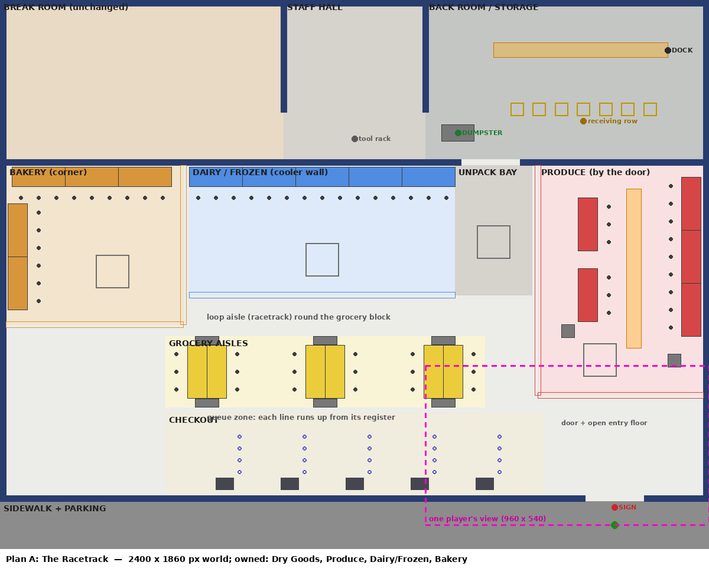

**Plan B — Grows Outward** (final store; growth stages in section 3)
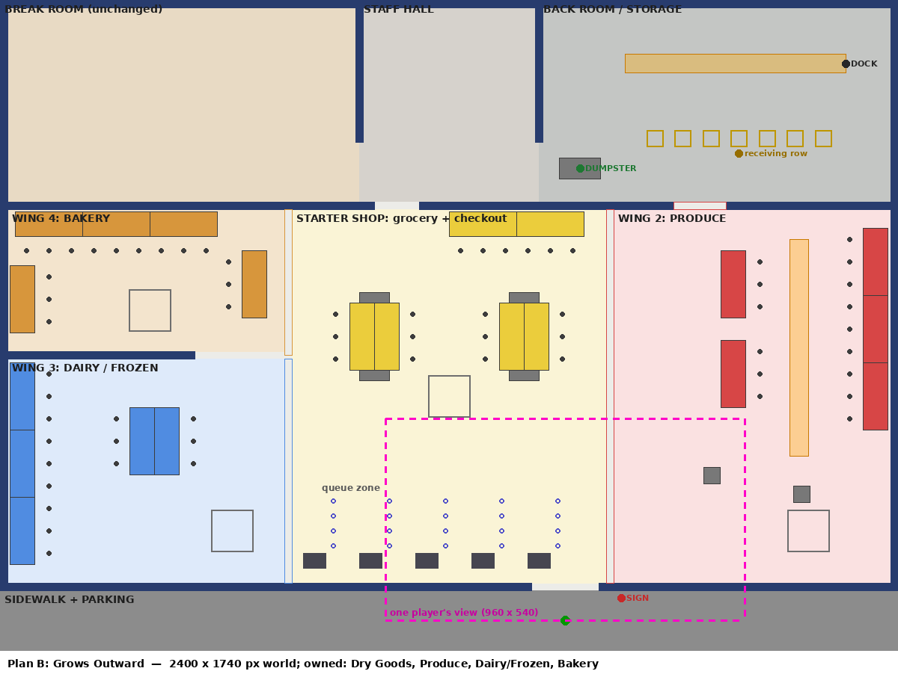

**Plan C — The One-Screen Market**
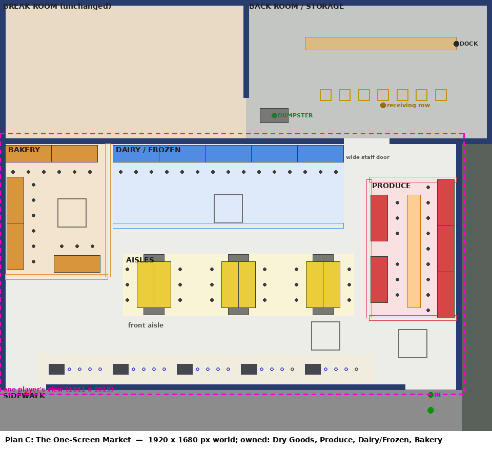

---

## 1. What exists today

### Screenshots (taken this session in Godot 4.7, HUD hidden)

Whole store, Shift 1 (only Dry Goods owned; locked rooms dimmed):
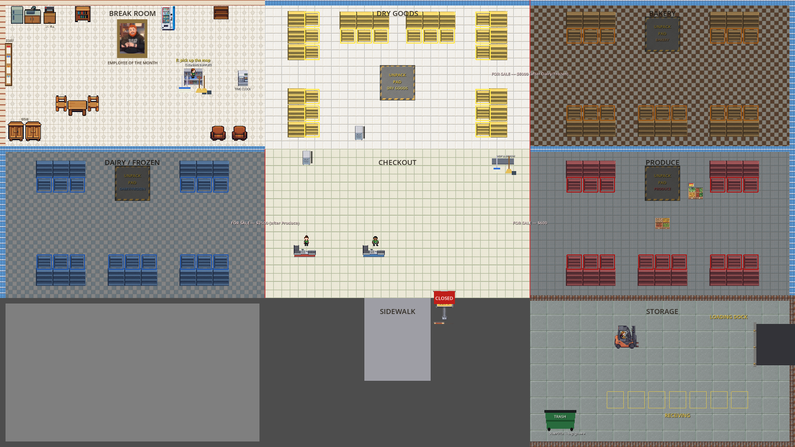

Whole store, all sections owned:
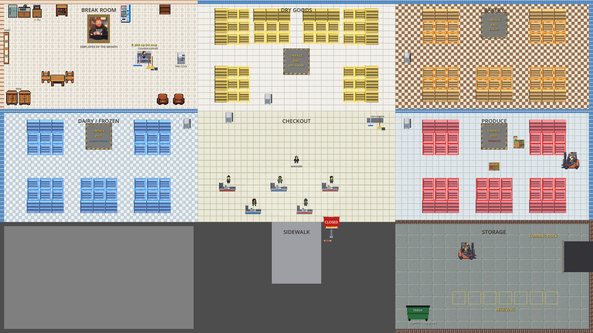

What one player actually sees (960 × 540, camera zoom 1, a busy shift):
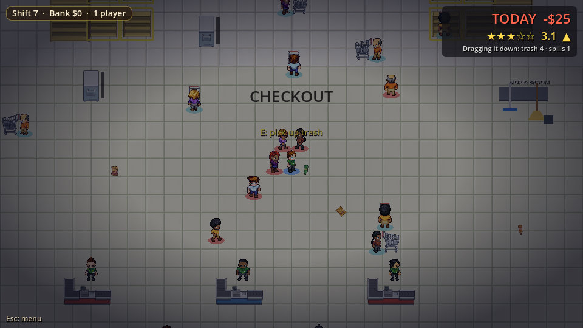

### How it's built

- **The world** is 2880 × 1620 px: a 3 × 3 grid of 960 × 540 "rooms"
  (`Main.gd`: `ROOM_WIDTH/HEIGHT`, `GRID_COLS/ROWS`, `WORLD_WIDTH/HEIGHT`).
  The map is written down in one comment at the top of `Main.gd`:

  ```
  (0,0) Break Room    (1,0) Dry Goods      (2,0) Bakery
  (0,1) Dairy/Frozen  (1,1) CHECKOUT HUB   (2,1) Produce
  (0,2) [empty]       (1,2) Sidewalk       (2,2) Storage
  ```

  The grid replaced an older "row of 7 rooms" because long walks made shoppers
  time out, and that lesson still holds: **keep the worst-case walk short.**
- **Sections** (`Main.SECTIONS`) are identified by their grid cell. Buying one
  (`sections_owned`, bought in the order Dry Goods → Produce $600 → Dairy/Frozen
  $2,500 → Bakery $6,000) opens its **Gate**. A gate is a 20 × 540 px barrier
  that seals the *whole* edge of the room (`Gate.gd`, `Gate.tscn`). It used to
  be a narrow doorway, but NPCs jammed in it, so it was widened to the full edge.
  Locked rooms are dimmed.
- **Shelves:** Dry Goods has 6, the others 5 each (`Shelf.tscn`, a 180 × 66 body
  with 3 slots 70 px in front). From the 3rd section on, a second stock row sits
  56 px further out, and a shopper stands 29 px beyond the slot. So **a shelf
  needs about 155 px of open floor in front of its centre.**
- **Checkout:** 5 registers in two staggered rows in the hub (`CentralCheckout`).
  The number open follows the sections owned (`CASHIER_COUNT_BY_TIER` 2/3/4/5).
  Each queue is 4 spots running east from its register (`Cashier.tscn`).
- **Entrance:** shoppers spawn on a small sidewalk strip below the hub
  (`SIDEWALK_STRIP_CENTER`) and leave the same way. The bounce zone is "south of
  the hub" (`is_outside_door`), and the open/closed store sign stands by it
  (`STORE_SIGN_POS`).
- **Back room:** Storage is a 960 × 540 room. A box truck backs into a dock on
  the east wall (`Delivery.gd`: `LANE_Y`, `DOCK_X`, the truck drives off past the
  world's east edge), a forklift runs an east-west lane, 7 receiving spots sit
  in a row, and the dumpster is in the south-west corner (`Cleanup.DUMPSTER_POS`).
  Customers are kept out by an "excluded zone" check (`is_storage_at_pos`), not
  by a door.
- **Unpack pads:** one per section, inside that section (`Delivery.PAD_CENTERS`).
  A box unpacks into a ring of loose stock 80–150 px around the pad, so **each
  department needs roughly 300 × 300 px of open floor for its pad.** That
  turned out to be the tightest constraint when drawing new plans.
- **Break room** sits at the world origin: furniture (`BreakRoom.gd`), the gear
  lockers (`Shop.LOCKER_SPOT`), the Staff Board (`Staff.BOARD_POS`), the time
  clock and the tool station (`Cleanup.STATION_POS`). All of these are
  world-position constants.
- **Trash cans:** 5 (`Cleanup.BINS`): one in the hub, one at each section's
  door. The janitor walks the same navigation grid with Storage allowed and the
  forklift's floor kept out (`CustomerNav.JANITOR_KEEP_OUT`).
- **Hazards:** the Produce forklift patrols Produce's east-west aisle (its
  bounds are worked out from its grid cell). The manager walks a cell-to-cell
  route. Spills and leaks spawn in each section's band, a fixed strip
  120–360 px into the room.
- **Camera:** one per player, following that player at zoom 1, limited to the
  world (`Player.gd`). Each player is on their own PC (online co-op), and the
  window is 960 × 540 with `canvas_items` stretch, so **fullscreen shows the
  same 960 × 540 world area, just bigger.** A player sees one room at a time.
- **Navigation:** the 3B shopper grid (`CustomerNav.gd`, Godot `AStarGrid2D`,
  20 px cells, 16 px clearance) is built from the walls, gates, shelves,
  registers, displays and `nav_obstacle` groups. **That part is already
  layout-agnostic.** Only its size (`ROOM_WIDTH * 3`) and its excluded zones
  (break room and storage cells) assume the grid. Helpers instead run their
  own grid **sized to one room** (`Helper.gd`, plus a fixed band `BAND_Y`).

### How much is hard-coded

| Where | What | Rough count |
|---|---|---|
| `Main.tscn` | placed walls, gates, shelves, registers, labels, floor polygons, displays | 58 placed nodes (115 nodes total) |
| 16 game scripts (`Main`, `Delivery`, `Cleanup`, `Customer`, `Tutorial`, `Manager`, `BreakRoom`, `Ambience`, `Helper`, `Janitor`, `Forklift`, `StoreArt`, `CustomerNav`, …) | world-position constants, or the "which cell am I in" math (`ROOM_WIDTH`, `grid_pos`, `_grid_cell_of`, `is_unlocked_at_pos`, …) | ~200 references; `Main.gd` alone ~90 |
| 25 test / screenshot tools (`hazards_test` 63+21, `upkeep_test` 42, `janitor_test` 16, `sound_test` 13, …) | coordinates written into the tests | ~330 references |
| Regression suite | `tools/run_regression.sh` | 61 entries, solo and co-op, several hours of wall time |

### Saves

The save (`SaveGame.gd`, **version 6**, the version Phases 4B through 5 ended
on) stores **no positions.** It stores shift, bank, lifetime earnings,
`sections_owned`, stage, staff (keyed by section *name*), gear, events, the
rating, and how full each trash can is, **by can index** (5 cans). So none of
the three plans needs a save change, as long as Part 2 keeps 5 cans in today's
order (hub, Dry Goods, Produce, Dairy/Frozen, Bakery). Section names and the
purchase order stay as they are.

---

## 2. What real supermarkets look like (design input)

General layout ideas, not any one store's plan:

- **Produce at or near the entrance.** It gives a first impression of fresh
  abundance. Dry grocery goes in the centre aisles, fresh departments (bakery,
  deli, meat, dairy, frozen) around the edge, checkout at the front, receiving
  and storage at the back
  ([Leafio](https://www.leafio.ai/blog/grocery-store-layout/),
  [POS Nation](https://www.posnation.com/blog/small-grocery-store-layout),
  [ChatDiagram example plan](https://www.chatdiagram.com/examples/floorplan/grocery-store-floor-plan)).
- **Staples (milk, eggs, frozen) toward the back or along the sides,** so
  shoppers cross the store
  ([Martech Zone](https://martech.zone/how-grocery-store-floor-layouts-influence-consumer-spending/),
  [Datawiz](https://ph-cms-dev2.datawiz.io/en/blog/grocery-store-layout-strategy)).
- **Grid vs racetrack.** Most supermarkets are a grid of parallel aisles. A
  racetrack or loop, where a main aisle circles the store past every department
  and ends at the checkout, suits smaller stores
  ([Datawiz](https://ph-cms-dev2.datawiz.io/en/blog/grocery-store-layout-strategy),
  [POS Nation](https://www.posnation.com/blog/small-grocery-store-layout)).
- **Aisle widths.** Main aisles are about 1.8–2.4 m, so two carts can pass;
  6.5 ft is the industry norm. Busy fresh areas need more room than quiet
  aisles. One simulation study found that uncrowded aisles work at 1.3 m but
  produce needs about 3.6 m
  ([Stockagile](https://stockagile.com/en/blog/do-aisles-affect-shopping-speed/),
  [RDC](https://rdcollaborative.com/grocery-stores-dive-deeper-into-design-to-encourage-longer-visits/),
  [BUiD study](https://bspace.buid.ac.ae/handle/1234/1466)).
- **The entrance needs an open "decompression zone"** of a few metres before
  the first display. Feature displays go at the far edge of it, and queues must
  not spill across the doors
  ([Ariadne](https://www.ariadne.inc/resources/blogs/retail-decompression-zone/),
  [Vomela](https://blog.vomela.com/3-entryway-mistakes-retailers-make-that-ruin-first-impressions)).
- **Checkout** can be parallel lanes, each with its own line, or one snaking
  line feeding every till. A single line feels fairer, while parallel lanes suit
  high-volume grocery
  ([Studio Matrx](https://www.studiomatrx.org/students/retail-and-store-design/the-checkout-and-point-of-sale),
  [Grocery Dive / Hershey](https://www.grocerydive.com/spons/what-is-a-queue-worth-hershey-is-answering-that-questionand-then-designin/694572/)).
- **Receiving sits right next to the loading dock,** with a holding area so
  deliveries don't jam
  ([Infoplus](https://www.infopluscommerce.com/blog/efficient-receiving-area-layout),
  [UMN grocery warehouse report](https://ageconsearch.umn.edu/record/311188/files/mrr348.pdf)).
- **Supermarket Simulator** keeps storage as a separate room you buy, and
  expands the shop floor in purchased blocks that push the outside walls out
  ([Steam discussions](https://steamcommunity.com/app/2670630/discussions/0/600776571073121656),
  [CommonSenseGamer](https://commonsensegamer.com/supermarket-simulator-storage-upgrade-is-it-worth-it-hcfe/)).

**What this means in game units.** Characters are 28 px and the floor tiles
are drawn 30 px wide (48 px pack tiles × 0.625). The game's rule that a shelf
needs ~155 px of open floor in front of it matters more than real-world
proportions. So **aisles between two facing shelves are ~260–300 px (9–10
tiles), main aisles are at least 140 px, and every department needs one
~300 × 300 px open patch for its unpack pad.** Every department opening is
full-width (shutters and knocked-out walls), never a doorway, because of the
old doorway-jam lesson.

---

## 3. The three plans

All three keep the following, so most systems only *move*, they don't change:

- the same 21 shelves (6/5/5/5), 5 registers, the 2–5 open-register tiers, the
  Produce forklift, 2 displays, 4 pads and 5 cans;
- **the break room exactly where it is today** (world origin, 960 × 540), so
  `BreakRoom.gd`, the lockers, the Staff Board, the time clock and the tool
  station don't change;
- **today's Storage room moved as one block** (dock on the east wall, the same
  lane, receiving row and dumpster positions inside it). Every `Delivery.gd`
  number shifts by one offset;
- the back of house runs along the back wall, with staff doors into the store.
  Customers stay out of it, as today.

### Plan A — The Racetrack

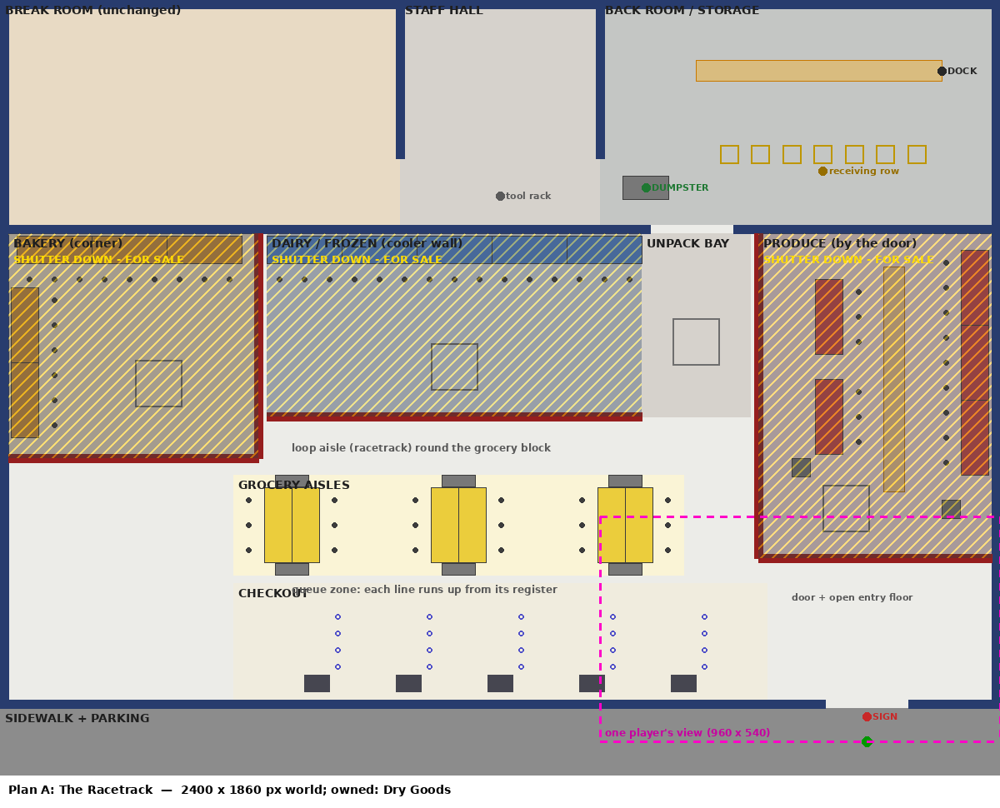

**Description.** One big supermarket hall (2400 × 1860 world) exists from shift
1. A loop aisle runs round a central block of three grocery gondolas (Dry
Goods, two shelves back to back each), with end caps. Dairy/Frozen is a cooler wall along the back, Bakery is
in the back-left corner, and Produce is along the right wall beside the door.
The 5-lane checkout runs across the front with an open queue zone behind it,
and the entrance is by Produce. Locked departments are visible behind a
**roll-down shutter** with a FOR SALE sign. On purchase the shutter rolls up.
Nothing moves and the building never changes shape. An unpack bay off the staff
door holds Dry Goods' pad, so the crew carries a short way from the back room.

| Topic | Plan A |
|---|---|
| **Departments and growth** | Every department is a real wall or corner department: the cooler wall reads as "dairy" at a glance, the corner as "bakery", and the tables by the door as "produce". **Before a purchase:** the department is visible but dimmed behind a shutter with its price. **After:** the shutter rolls up (the gate collision turns off, as today). Growth is visible as the store "lighting up", not getting bigger. |
| **Entrance, queue, checkout** | A single wide door (200 px) by Produce, with open entry floor before the first display. 5 lanes along the front, **queues running north into a dedicated queue zone**, so lines never reach the aisles. Lanes open nearest the door first, the 2→5 tier as today; closed lanes show a "lane closed" sign. |
| **Back room, forklift, truck, dumpster, cans, janitor** | Storage (as today) behind the back wall; the truck uses the east-wall dock and leaves east as now. A staff hall links the break room and storage, and one 200 px staff door opens into the unpack bay. Dumpster in the back room (as today). Cans: one at the checkout plus one at each department's mouth. Janitor route: back room → staff door → loop aisle; the keep-out rect moves with Storage. The Produce forklift runs **north-south** inside Produce. |
| **Co-op readability and camera** | Scrolls both ways like today (2.5 × 3.4 screens). Fullscreen shows the same area. In any 960 × 540 clip you can name the department from its fixture type (cooler wall, gondolas, tables, bakery cases) and floor, which is better than today's identical rooms. Three players, a full crowd, helpers and events still don't fit on one screen; events stay announced by the HUD as now. Optional for Part 2: a hold-Tab store map. |
| **Pathing** | Aisles between gondolas 268 px (room for the two-deep stock row on both sides and a passing lane), the loop aisle ≥140 px, the front aisle ~100 px (**widen to 160 in Part 2**). Likely stuck points: the corners where shutters meet end caps, the end-cap mouths, the 194 px Produce aisle shared with the forklift, and the single door (shoppers pass through each other; players don't). The nav grid is the same code with a new world size and new excluded rects. Helpers need the most rework here, because their departments are strips and corners, not rooms. |
| **Walking and crowding** | Shopper walk **+19 % at 1 section, +3 % at 2, +7 % at 4** (the door is by Produce, so early shoppers cross the hall). Crew carry **−36 %**. Open floor about the same as today, so crowding is unchanged. Expected income: roughly neutral, slightly down early (longer shopper walks), slightly up later (faster restocking). Part 2 must measure. |
| **Risk and cost** | Every system moves; the biggest jobs are the area refactor, helper strips, the manager's route graph, the north-facing queues, shutter art, and tests. **No save change.** **~75–110 hours.** |
| **Survives a tileset swap?** | Yes: all geometry is in world px. Needs shutter/grille art, cooler-case, gondola and end-cap art, and a "lane closed" sign in whatever set is chosen. |

### Plan B — Grows Outward (recommended)

Shift 1, Dry Goods only (the wings are empty lots behind outside walls):
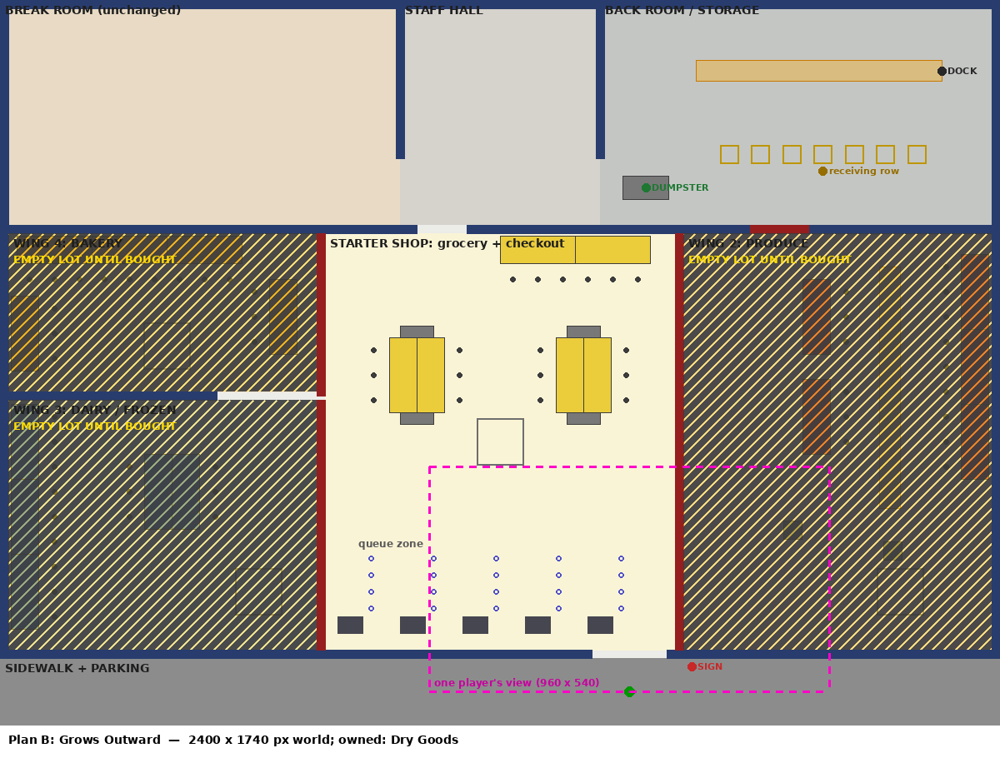

After buying Produce:
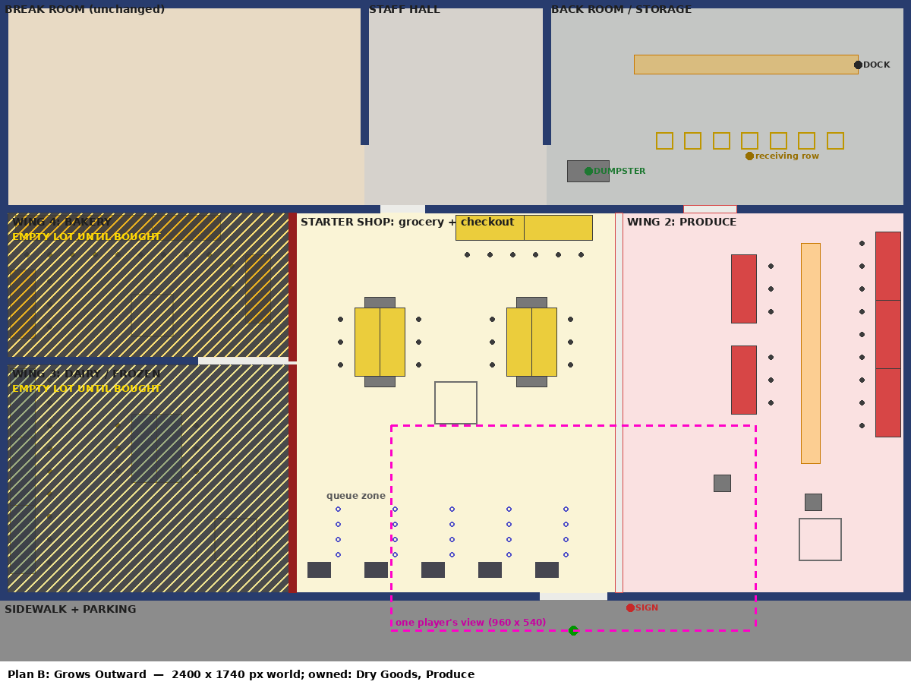

**Description.** The store starts as a **small corner shop**: two grocery
gondolas and a back-wall shelf run, a 5-lane checkout (2 open) and the door, with the full back of
house behind it. Each purchase **knocks out one outside wall** and the new wing
is behind it: Produce to the right, next to the door; then Dairy/Frozen to the
left, with coolers on its outer wall; then Bakery in the back-left corner,
opening from both the shop and the Dairy wing. Existing parts never move. The
finished store matches the real-supermarket pattern from section 2. The
"knock-out wall" is today's Gate with outside-wall art when closed, invisible
when open, so it is the same mechanic.

| Topic | Plan B |
|---|---|
| **Departments and growth** | Each department is a recognisable wing: Produce (tables + wall run + sale bin) by the door, Dairy/Frozen (cooler cases on the outside wall + an island case), Bakery (corner cases). **Before a purchase:** that side of the shop is an outside wall with a FOR SALE banner; beyond it (seen when the camera reaches it) an empty lot. **After:** the wall is gone, the wing's floor, shelves and sign are there, and the camera can roam into it. The Produce wing's own back door into storage opens at the same moment. This is the plan where you most *see* progress. |
| **Entrance, queue, checkout** | The door is at the shop's front-right corner, with Produce beside it once bought. 5 lanes along the shop's front from day one (2 open, 3 dark), with queues running north into a queue zone. With 5 shoppers at shift 1 the starter shop is busy but readable. |
| **Back room, forklift, truck, dumpster, cans, janitor** | The same back band as A (break room unchanged, staff hall, Storage block with its east dock). Staff door into the shop (widen to 200 px in Part 2), plus the Produce wing's back door. Cans: one at the checkout plus one inside each wing's opening. Janitor: back room → staff door → shop → wings. The Produce forklift runs north-south inside the Produce wing. |
| **Co-op readability and camera** | Shift 1 the whole shop is about 1 × 2 screens: the best early readability of the three at full zoom. The full store scrolls like today. Camera limits can stay at the full world: the empty lots are part of the picture (they advertise what's next). Fullscreen shows the same area. |
| **Pathing** | Each wing is a room with full-width openings. The shop's grocery aisle is 268 px between gondola faces, the side aisles ~154 px (one shelf face each); the wings' aisles are 254–314 px. Stuck points: the Bakery-Dairy wall opening (240 px), the narrow early shop at full crowd if a crew buys late, the end caps. Nav grid: the same code; knocked-out walls are gates, already rebuilt on purchase (`CustomerNav.invalidate()`). **Helpers keep working the way they do now** (each wing is a rectangle, like today's rooms), which is the main reason B's code cost matches A's. |
| **Walking and crowding** | Shopper walk **+3 % / −1 % / −3 %** (1 / 2 / 4 sections), about the same as today. Crew carry **−19 %**. Open floor 93 % of today's; crowding about the same. Expected income: neutral to slightly up from faster restocking. Part 2 must measure. |
| **Risk and cost** | The same refactor as A, plus outside-wall/lot visuals and the per-wing back door. Less helper rework than A. **No save change** (wings follow `sections_owned`). Do **not** make expansions a separate purchase: that would need a save v7 and an economy change. **~80–115 hours.** |
| **Survives a tileset swap?** | Yes. Needs exterior wall/storefront art, an "empty lot" ground (asphalt, gravel, fence or hoarding), a FOR SALE banner, and the same shelf, cooler and checkout categories as A. |

### Plan C — The One-Screen Market

Shift 1:
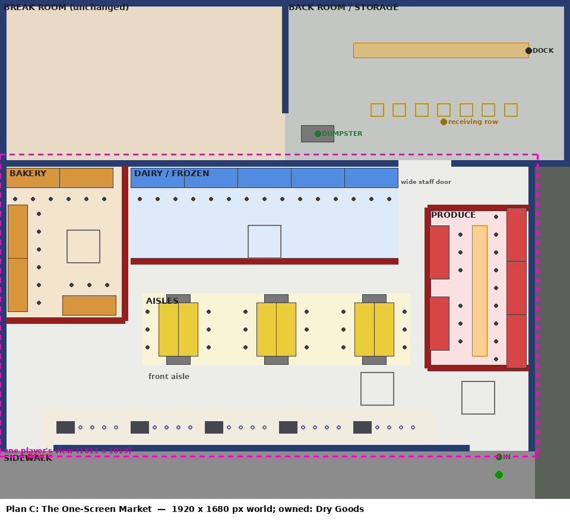

**Description.** A deliberately compact store (sales floor 1800 × 980) built
so the **whole floor fits one camera view at zoom 0.53**: every player sees
every other player, the whole crowd, the forklift and every event at once,
Overcooked-style. Shoppers come in an IN door at the front-right by Produce and
leave by an OUT door at the front-left past the registers. Dairy is a back
cooler wall, Bakery a back-left corner, grocery aisles in the middle. The back of
house sits behind a wide staff door; there the camera goes back to zoom 1 and
follows the player.

What a player would see at 960 × 540 (diagram):
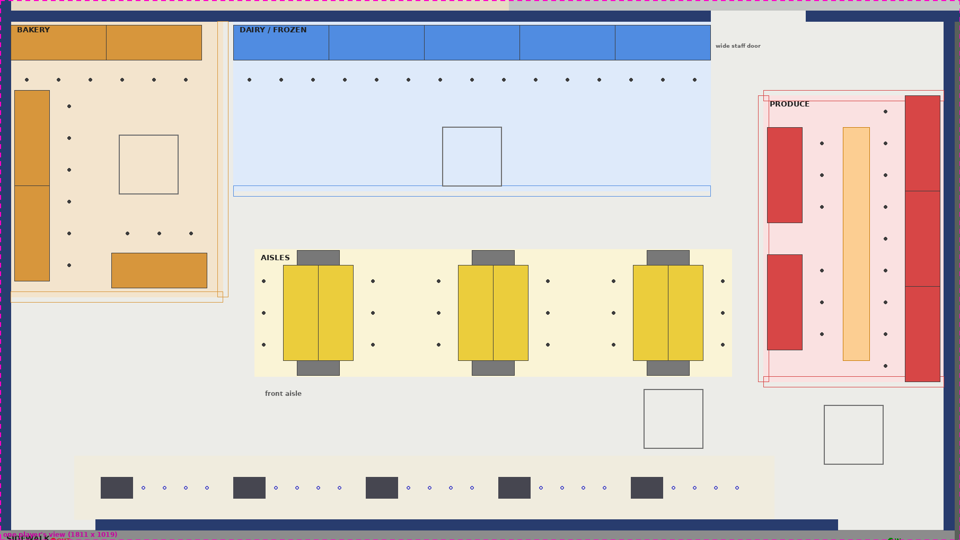

The same zoom on **today's** store, in game, mid-shift. This is how small the
current art gets:
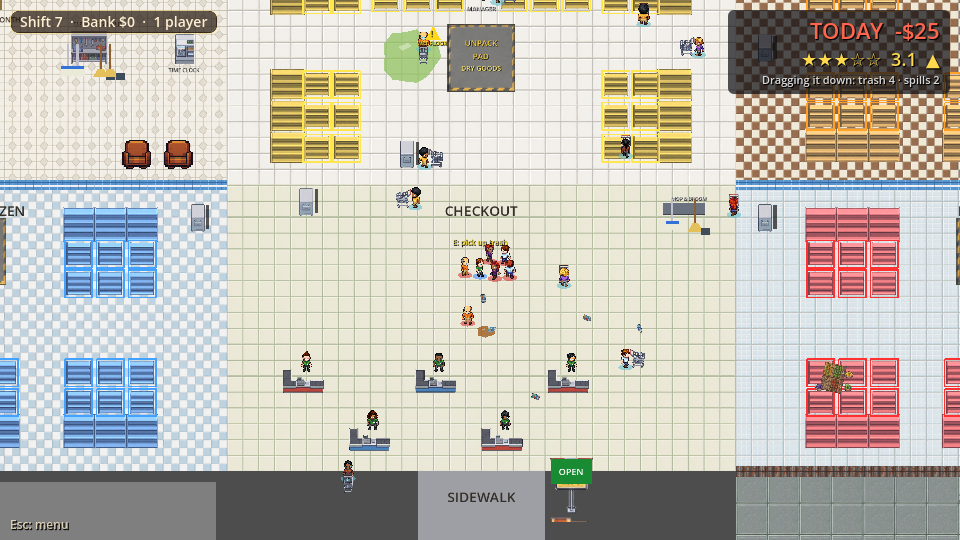

| Topic | Plan C |
|---|---|
| **Departments and growth** | Same shutter idea as A, in a smaller box. Growth is the store lighting up, not getting bigger. |
| **Entrance, queue, checkout** | The IN/OUT split gives the classic "through the store to the tills" flow. 5 lanes along the front with queues running sideways (as today's), between the front aisle and the OUT door. A single snaking line was considered but would be a new queue system; not proposed. Note that shoppers still go wherever their list says (A* takes the shortest path), so the one-way flow is a suggestion of the layout, not enforced. |
| **Back room, forklift, truck, dumpster, cans, janitor** | Back band as in A/B (break room unchanged, Storage block). One wide (180 px) staff door: **the single chokepoint for every box and every helper**, a real griefing and blocking risk with 3 players. The Produce forklift's lane is in a 194 px aisle. |
| **Co-op readability and camera** | Best by design: no scrolling on the floor. But the screenshot above shows the cost: at 960 × 540, characters are ~15 px tall, litter and labels are barely readable, and the HUD and world labels would need a legibility pass. A 1080p fullscreen doubles every pixel and looks fine. Pixel art at a non-integer zoom also shimmers when it moves. Needs a camera-mode switch at the staff door. |
| **Pathing** | Everything is tighter: the grocery aisles are 198 px (the two-deep stock rows on facing shelves overlap, so shoppers and the crew share standing room), the front aisle ~160 px for up to 17 shoppers, pads pressed against walkways (Produce's is in the entry floor), the loop past the shutters ~110 px. The most stuck-point risk of the three. |
| **Walking and crowding** | Shopper walk **+3 % / −7 % / −15 %**; crew carry **−40 %**. But the open floor is **60 % of today's**, so the same crowd is **~65 % denser**. Expect income *up* (shorter walks, faster restocking) and more bumping and blocking, so the Phase 5 balance would have to be redone. |
| **Risk and cost** | Same refactor + camera zoom/framing modes + UI legibility pass + crowd re-balance. **No save change.** **~95–140 hours, plus a balance pass of Phase 5's size.** |
| **Survives a tileset swap?** | Only if the new set is chosen for readability at half size (bold silhouettes, high contrast). This plan depends most on art that isn't picked yet. |

---

## 4. Side-by-side measurements

Measured with `docs/store-layout/layout_model.py`. It rebuilds each layout as
rectangles and walks shoppers on a **20 px grid with the same 16 px clearance
as the game's `CustomerNav.gd`**. Each shopper starts at the entrance, visits a
random slot for each item on a list drawn by the game's `SHOPPING_LIST_BY_TIER`,
goes to the nearest open register, then leaves (160 shoppers per row, the same
random seed for every layout). "Crew carry" is the walk from the middle of the
receiving row to each section's unpack pad. **Check:** the model of *today's*
store is drawn from the real coordinates
([diagram](store-layout/current_model.png)) and matches the screenshot.

| Layout | Sections | Shopper walk, avg | 90th pct | Crew carry (avg over sections) |
|---|---|---|---|---|
| Today | 1 / 2 / 4 | 28 / 39 / 55 s | 33 / 51 / 81 s | 1846 px (8.4 s at player speed) |
| A | 1 / 2 / 4 | 33 / 40 / 59 s | 43 / 56 / 82 s | 1187 px (−36 %) |
| B | 1 / 2 / 4 | 29 / 38 / 54 s | 34 / 50 / 74 s | 1493 px (−19 %) |
| C | 1 / 2 / 4 | 29 / 36 / 47 s | 35 / 47 / 62 s | 1105 px (−40 %) |

| Layout | World size | Open sales floor | Per shopper at the top tier's 17 |
|---|---|---|---|
| Today | 2880 × 1620 (9.0 screens) | 2.01 M px² | 118 k px² |
| A | 2400 × 1860 (8.6) | 2.05 M px² | 121 k px² |
| B | 2400 × 1740 (8.1) | 1.86 M px² | 109 k px² |
| C | 1920 × 1680 (6.2) | 1.21 M px² | 71 k px² |

**What this means.** Walking is mostly a wash: the hub layout is already short
for shoppers, so no plan wins or loses much income from walking alone. The real
gameplay levers are **crew carrying** (all three are shorter, mainly because the
back room touches the sales floor) and **crowding** (only C changes it).

**Not measured here:**

- **Real income:** the bot harness can only run a layout that exists in the
  game, so it waits for Part 2. Estimating it with a model would just be a
  guess.
- **Queue and shelf time:** the same in every plan, since the registers and
  slots are unchanged.
- **Disruptive customers and stuck events:** these need the real physics.

Part 2 measures all of it (section 7).

---

## 5. Constraints check

| Must keep | A | B | C |
|---|---|---|---|
| Sections bought from the bank (in order, at today's prices) | shutters | knock-out walls | shutters |
| Section helpers + janitor | helpers need strip/corner rework | helpers almost unchanged (rooms) | strip rework + tight floor |
| Shopping lists, carts, open-register tiers | ✔ | ✔ | ✔ |
| Trash cans (5, same order) + dumpster | ✔ | ✔ | ✔ |
| Rating | ✔ (inputs unchanged) | ✔ | ✔, but crowding changes its inputs |
| Lunch Rush, Inspection, Leaky Roof, Catering, Surprise Delivery | ✔ (leak bands become per-area) | ✔ | ✔ |
| Gear lockers, Staff Board, break room | ✔ unchanged | ✔ unchanged | ✔ unchanged |
| Pause, settings | ✔ | ✔ | ✔ |
| 3-player clip test | ✔ better than today | ✔ better than today | ✔ best when zoomed; small sprites |
| No easy chokepoint griefing | one door 200 px, staff door 200 px | staff door to widen to 200 px | **one staff door for everything** |
| v6 saves load | ✔ no change | ✔ no change | ✔ no change |

---

## 6. Recommendation

**Build Plan B.**

1. **It fixes the actual complaint.** The finished store has the real
   supermarket's landmarks in the right places, from the research: produce at
   the door, dairy on a side wall, bakery in a corner, centre aisles, front
   checkout, back room with a dock.
2. **It adds the strongest shopkeeper-sim feeling for free:** the store
   physically grows when you buy a section. You "own" the empty lot next door
   before you buy it, and nothing you've learned ever moves. Players see the
   first growth inside the 4-shift demo (Produce is bought by shift 3 solo and
   shift 2 in co-op, Phase 5 table), which is a strong trailer and Steam
   screenshot.
3. **Its wings are rooms,** the shape today's helper, manager, forklift and
   spill code already assume. That keeps code risk at Plan A's level despite
   the extra visuals.
4. **Walking and crowding stay about where Phase 5 tuned them,** so the balance
   should hold. Part 2 confirms it rather than redoing it.

**The tradeoff, plainly:** B costs more *art* than A (outside walls, a
storefront, an "empty lot" look, FOR SALE banners). Its first few shifts are
in a small, busy shop. Its final store reads as "connected wings" rather than
one textbook hall. If you'd rather have the one-big-hall look and don't care
about growth, choose **A**: about the same cost, a little longer shopper walks
early on, and more helper rework.

**Rejected: Plan C.** Seeing the whole store at once is the right instinct for
co-op, but this way of getting there has three problems. The art and text get
too small at the default 960 × 540 window (see the screenshot). The floor would
be 65 % more crowded, which undoes Phase 5's balance work. And it is the plan
most dependent on art that hasn't been chosen yet. If whole-store awareness
matters, a **hold-Tab store map** (a schematic overlay with players, helpers,
events and full cans) can be added to A or B later for ~6–10 hours, with
neither cost.

---

## 7. Part 2 build plan (for Plan B)

### Order of work

0. **Baseline on `main` first** (same machine as the later runs):
   `staff_test --test=income` solo and 2-player at 1, 2 and 4 sections,
   `--test=progress` solo, the soak's per-subtree node counts, and
   `shopping_test`'s traffic numbers (stuck pins, `path_us_max`).
1. **Step 0, the area refactor, with no visible change.** Add one layout table
   (section areas as rects, back-of-house areas, the door/outside rect, a
   `STORAGE_ORIGIN`, a pad and can list). Replace every `_grid_cell_of`,
   `grid_pos`, `ROOM_WIDTH * n` and per-room band with it: `Main`, `Customer`
   (`_push_out_of_cell`, the bounce check), `Helper` (its room = its section's
   rect), `Manager` (cell route → waypoint list), `Forklift` (lane rect),
   `Ambience` and `Events` (spawn bands per area), `Delivery` and `Cleanup`
   (offsets), `Janitor`, `StoreArt`, `Tutorial`. Make the tests read
   coordinates from the same table instead of literals. **Run the full
   regression; it must pass with the current store unchanged.** This step is
   worth merging on its own: any future layout change becomes data.
2. **Gates → "barrier segments":** any length, several per section, with a
   closed look per segment (outside wall / shutter). `_configure_gates()`
   matches segments by section, not by node name.
3. **New geometry:** Plan B's walls, wings, shelves, registers, displays,
   labels and floor areas in `Main.tscn`; Storage moved by its offset; door,
   sidewalk, sign, bins, tool rack, janitor home, pads. Snap to a **60 px grid**
   where possible (it suits both the 20 px nav cells and the 30 px floor tiles;
   the diagrams are within ±20 px of that).
4. **Checkout facing north:** rotate the Cashier queue markers and the belt
   and lane art in `StoreArt`; check queue order and the "lane closed" look.
5. **Produce forklift north-south** (it already has front-view art), manager
   lookouts per wing, practice-shift (`Tutorial.gd`) prop spots and cards.
6. **Greybox visuals only** (no new art): floors per area, the closed-wall
   look, empty-lot ground, FOR SALE banners from existing tiles and colours.
7. **Camera:** limits from the layout's world size. No zoom change.
8. **Measure, tune spots (not numbers), screenshots, report.**

### Retest

Every `run_regression.sh` entry, solo and co-op, with special attention to:

- `shopping_test` traffic (stuck pins, timeouts = 0);
- `hazards` (forklift rams, displays, spills, deliveries, box sync, prep);
- `janitor_test` (dumpster path, keep-out, leak mopping);
- `upkeep_test` (cans, bags, dumpster, rating);
- `staff_test` (helpers inside wings, the Phase 5 forklift-escape test);
- `events_test` (all five);
- `manager_test`, practice shift, `save_test` (v6 loads; can fill by index);
- `join_test` (a late joiner sees the knocked-out walls and open wings);
- the menu and pause tests.

### What to measure, against the Phase 5 targets

- **Milestones** (`--test=progress`, solo / 2p / 3p): Produce by shift 3/2/2
  (target ≤ 4), all sections ~11/8/8 (target ~10), top tier ~16/13/14 (~16),
  everything ~24/21/21 (~24). Accept ±1–2 shifts (Phase 5's noise).
- **Income per shift** at each section count, solo and 2-player, versus the
  step-0 baseline: flag anything outside ±10 %.
- **Shift pacing:** prep and selling clocks are per section and don't change;
  watch the cleanup time (1–3 min target), since it depends on walking.
- **Rating:** with a janitor it should still sit around 3.5–4.5★.
- **Shopper health:** timeouts, stuck re-plans, average lifetime used.
- **Performance:** nav build and path cost (`build_us`, `path_us_max`), frame
  time in the soak, and node counts per subtree. Expect a few more static
  bodies (wall segments) and about the same total.

### What could go wrong

- Step 0 finds more hidden "one cell = one section" assumptions than counted
  here. The most likely spots are the out-of-bounds rescue, the bounce zone,
  and anything comparing a position's cell to another's.
- Helpers' "band" logic was tuned to today's room shape; wings with wall-run
  shelves may need a different band.
- North-facing queues: the queue markers are scene children and rotate with
  the counter, but the belt/lane art and the "nearest register" choice should
  be checked.
- Spill rings in smaller areas put loose stock in walkways (nav obstacles), so
  shoppers re-plan more.
- The starter shop at shift 1–3 is small: if a crew delays Produce, the early
  crowd (5–9) concentrates there.
- The known Godot 4.7 engine crash in long co-op bot runs (Phase 5 report,
  section 7) makes the long measurements flaky. Budget re-runs.
- The art swap later may change shelf or counter footprints. Keep every size in
  the layout table so that's an edit, not a rebuild.

### Size

| Part | Hours |
|---|---|
| Baseline runs (mostly machine time) | 2–4 |
| Step 0 area refactor + tests reading the layout table | 30–45 |
| Barrier segments | 3–5 |
| Plan B geometry + moved constants | 10–14 |
| Checkout facing north | 3–5 |
| Forklift / manager / tutorial | 8–12 |
| Greybox visuals | 8–12 |
| Measurement, spot tuning, report | 12–18 |
| **Total** | **~80–115 hours** (about 2–3 full-time weeks), plus several hours of unattended test runs |

(Plan A for comparison: ~75–110 h. Plan C: ~95–140 h + a balance pass.)

**Timing note:** the Steam page is targeted for Dec 15. Screenshots for it
should show the new layout *with* final art, so the order that works is: Part 2
in greybox (step 0 can start now) → art decision → art pass on the new layout →
screenshots.

---

## 8. What the art swap needs from the layout

So Part 2 and the later art session line up:

- **Scale contract:** characters are 28 px; floor tiles are drawn 30 px wide.
  Today's packs are 48 px RPG Maker MV tiles at `StoreArt.ART_SCALE` 0.625.
  Any replacement set (16, 32 or 48 px source) should be scaled so one floor
  tile is 30 px and a character is about 28 px tall. Plan B's geometry is
  independent of the tileset at that scale.
- **Gameplay footprints the art must fit** (the art can be decorated, but
  these collision sizes drive the layout):
  - shelf 180 × 66 with 3 stock slots on one face, plus a second row 56 px out;
  - register counter 60 × 40 with a 4-spot queue;
  - forklift 92 × 44 (side and front views);
  - display 44 × 44;
  - unpack pad 112 × 112;
  - dumpster 110 × 56;
  - box 44.
- **Wall and floor sets needed:**
  - floors: Dry Goods/shop, Produce, Dairy/Frozen, Bakery, checkout, back-room
    concrete, break room, sidewalk and parking, and an empty-lot ground;
  - walls: interior sales-floor walls, back-room metal or block, and an
    **exterior storefront** (glass front + entrance) and exterior side walls.
- **Asset categories to buy or commission:**
  - long gondola shelving and **end caps**;
  - **cooler cases** (open dairy, glass-door freezer);
  - produce tables and bins, bakery cases and racks;
  - checkout counters with a belt **seen from the side**, since the lanes face
    north (a top-down vertical lane);
  - "lane closed" sign, overhead hanging department signs;
  - automatic sliding entrance door, "Employees Only" swing doors;
  - loading dock door, box truck, pallets and boxes;
  - dumpster, trash cans, cart corral;
  - **for B:** a FOR SALE banner on an outside wall, construction hoarding or
    fencing for the lots. **For A or C:** a roll-down shutter/grille.
- **What survives a swap, per plan:** A and B work with any set at the scale
  above. C only works with a set chosen to read at half size.
- **Not addressed here (no art in this part):** the break room's "Employee of
  the Month" portrait and the rest of the asset audit's keep/replace list
  (`docs/asset-audit.md`).

---

## Files

- `docs/store-layout-proposal.md`: this document.
- `docs/store-layout/plan_a.png`, `plan_a_shift1.png`, `plan_a_view_960x540.png`
- `docs/store-layout/plan_b.png`, `plan_b_shift1.png`, `plan_b_two_sections.png`,
  `plan_b_view_960x540.png`
- `docs/store-layout/plan_c.png`, `plan_c_shift1.png`, `plan_c_view_960x540.png`
- `docs/store-layout/current_*.png`: in-game screenshots of today's store
  (Godot 4.7, taken with a throwaway script not added to the repo), plus
  `current_model.png`, the model's drawing of today's store used to check the
  model.
- `docs/store-layout/layout_model.py`: re-run with
  `python3 docs/store-layout/layout_model.py` (needs Pillow) to redraw every
  diagram and reprint the measurement tables.
