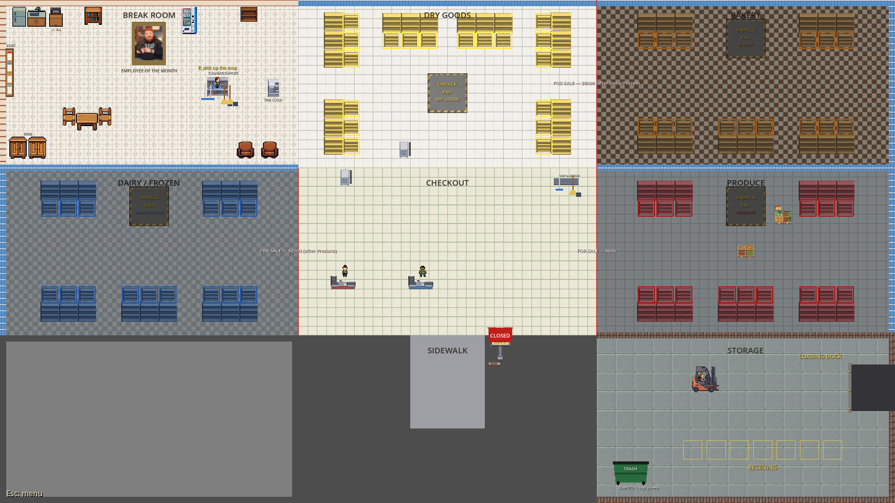
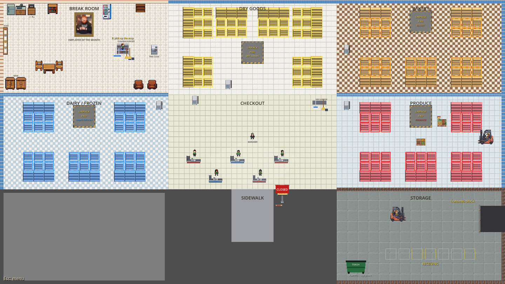
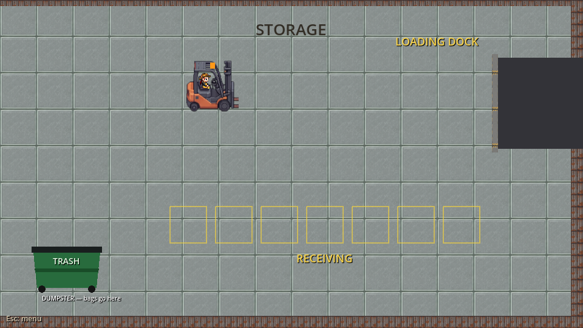
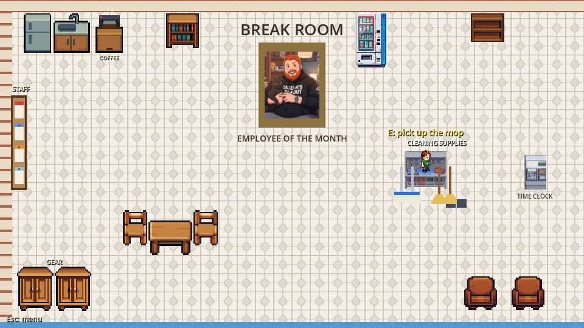
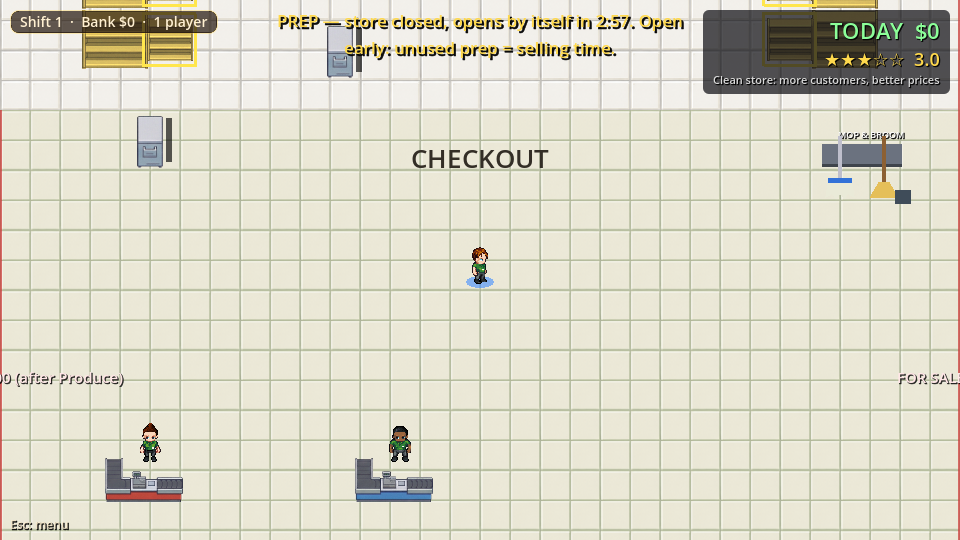
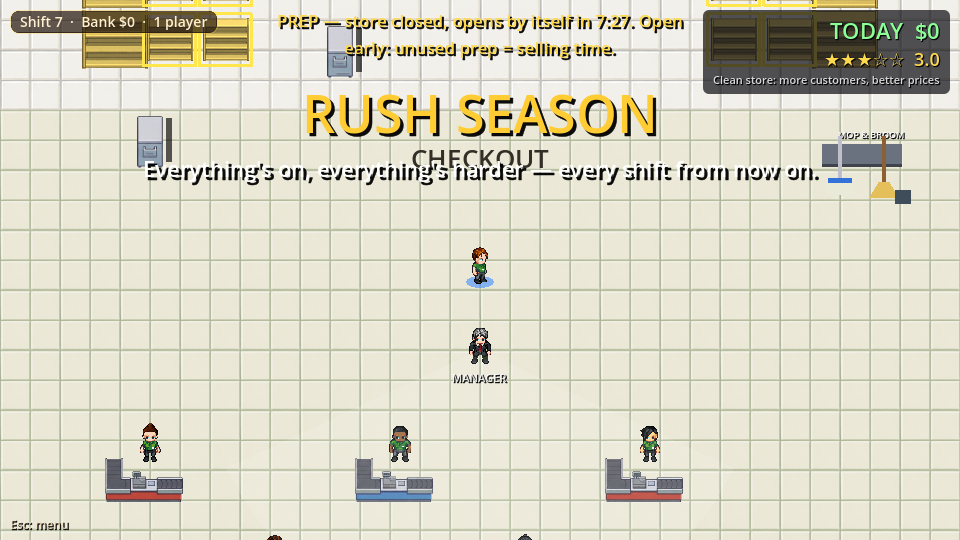
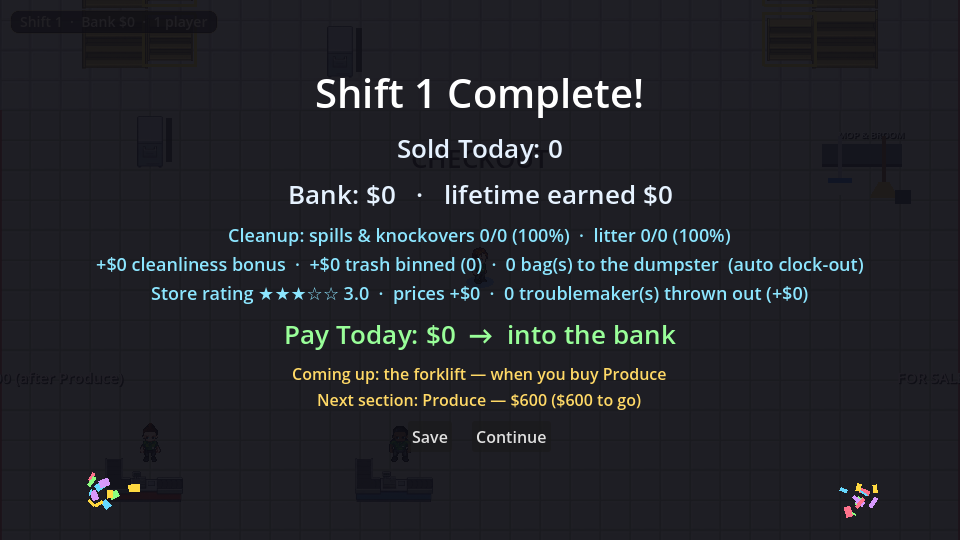
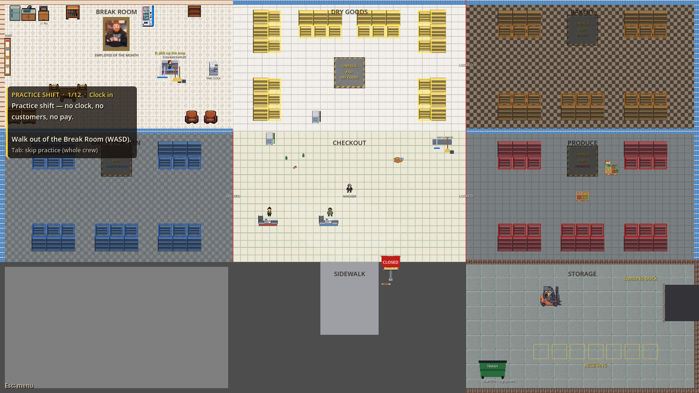

# Shift Work — Phase 5B Part 2A: Named Areas Refactor (report)

Branch `claude/adoring-euler-ym9i7h`, off `main` at `b202aa7`. Before starting,
`git log --merges` showed Phase 5 (PR [#37](https://github.com/nlfelch1997/Shift-Work/pull/37))
and the Phase 5B Part 1 layout proposal (PR [#38](https://github.com/nlfelch1997/Shift-Work/pull/38),
branch `claude/modest-gates-poee8r`) both merged into `main`.

**In one paragraph.** The game no longer works out "which 960 × 540 screen
cell am I in" anywhere. A data table, `StoreLayout.gd`, now holds today's
store: rooms, features, anchors and the checkout. A small registry,
`Areas.gd` (`main.areas`), answers every "what is at this position?" question
from that table. The table reproduces today's nine-room store exactly. The
proof is exact, not "within noise": clean `main` and this branch, run seeded
at fixed fps, produce **byte-identical screenshots, nav grids, lattice probes
and scene trees** at five store states (40 of 40 files, 0 differing pixels).
<<INCOME_SUMMARY>> No save change (still v6), no new network state, no layout,
art, price or balance change.

---

## 1. What was built

### The table — `physics-sync-test/StoreLayout.gd` (data only; nothing runs)

| Part | What it holds (today's values) |
|---|---|
| `WORLD` | `Rect2(0, 0, 2880, 1620)`: camera limits, out-of-bounds rescue, nav grid size |
| `ROOMS` (9, tile the world) | `break_room`, `dry_goods`, `bakery`, `dairy_frozen`, `hub`, `produce`, `reserved`, `sidewalk`, `storage`. Each has an `id`, a `role` (section / hub / storage / break_room / sidewalk / empty), a `rect` (or a `polygon`), and the flags the code used to derive from the cell: `section` (opens with that section), `shoppers` / `janitor` (nav-grid keep-outs), `shop_floor` (litter and janitor work), `bg` (its floor polygon), `wall_art` (wall material), `links` (open edges between rooms: the manager's routes), `spawn_band` (where spawned stock and spills land), `helper.band_y` (the helper's forklift-escape band) |
| `FEATURES` (4, inside rooms) | `produce_forklift_lane` (forklift_lane), `storage_forklift_floor` (the janitor's keep-out), `front_door_outside` (exit: the bounce zone), `customer_arrival` (customer_spawn: the sidewalk strip) |
| `ANCHORS` (16 named points) | player spawn, janitor home, front door, bounce target, store sign, tool rack, time clock, tool station, lockers, staff board and its spot, coffee and vending machines, dumpster, delivery-forklift home, practice puddle |
| `PADS`, `CANS`, `TOOL_SPOTS`, `PRACTICE_LITTER` | the 4 unpack pads; the 5 trash cans **in save order** (hub, Dry Goods, Produce, Dairy/Frozen, Bakery); the 6 tool spots; the practice litter |
| Back room | `STORAGE_ORIGIN` (1920, 1080), with the dock lane, dock edge, receiving row, dumpster and forklift floor written **relative to it**, so Storage moves as one block (all three plans do this) |
| `CHECKOUT` | room `hub`, `queue_dir` (1, 0) (east; Plan B turns it north), `registers_by_tier` [2, 3, 4, 5] |

The systems' old constants (`Delivery.PAD_CENTERS`, `RECEIVING_SPOTS`,
`LANE_Y`, `DOCK_X`, `FORKLIFT_HOME`, `Cleanup.BINS`, `DUMPSTER_POS`,
`STATION_POS`, `RACK_POS`, `TOOL_SPOTS`, `FRONT_DOOR`, `Janitor.HOME`,
`Shop.LOCKER_SPOT`, `Staff.BOARD_POS/SPOT`, `BreakRoom.COFFEE/VENDING_POS`,
`Main.SPAWN_CENTER`, `STORE_SIGN_POS`, `TIME_CLOCK_POS`,
`CASHIER_COUNT_BY_TIER`, `Tutorial.PROP_*`, `CustomerNav.JANITOR_KEEP_OUT`)
still exist but are now **aliases of the table**. Every test and save that
reads them gets the same value, and the table is the one place each is
written.

### The registry — `physics-sync-test/Areas.gd` (`main.areas`, a RefCounted Main owns)

| Call | Answers |
|---|---|
| `area_at(pos)` / `role_at(pos)` / `section_of(pos)` | the room id / its role / its section ("" outside) |
| `rect_of(id)`, `center_of(id)`, `role_of(id)`, `area(id)` | an area's shape and table entry |
| `room_ids()`, `ids_with_role(role, features)`, `feature_at(pos, role)`, `in_area(id, pos)`, `ids_without(flag)` | listing and membership |
| `is_open(id)`, `is_section_open_at(pos)`, `is_open_shop_floor_at(pos)`, `shoppers_allowed_at(pos)` | open/closed and who may be where |
| `route(from, to, via)` | rooms to walk through over the table's links (breadth-first, deterministic) |
| `anchor(name)`, `pad_of(section)`, `spawn_band_of(id)`, `world_rect()` | named points and bands |
| signals `area_opened(id)` / `area_closed(id)`, `refresh_open_state()` | growth hooks: fire on every peer when a section-tied room or feature changes state. `Main._reconfigure_world()` calls it, the same place every peer already re-applies the locked look. Nothing listens yet; Part 2B will. |
| `snapshot()` | a text dump of the whole table, for the snapshot test |

- **Same answer on every peer, no new network state.** The table is a
  constant. The only live input, whether a section is open, is asked of
  `Main.is_section_open()` at the moment of the question. That already
  reads replicated state (`sections_owned`, the practice flag), so a client
  answers exactly as the host does, with the same frame lag as before. No
  RPCs, synchronizers or replicated properties were added.
- **Cost.** `area_at()` looks the point up in a 20 px index built once from
  the table: one array read, no allocation. Only an index cell that
  straddles a room edge would fall back to testing the rooms that touch it,
  and on today's table every edge is on the 20 px grid, so that never runs.
  Rooms include their top/left edge and exclude their bottom/right edge,
  exactly like the old `floor(x / 960)`.
- **Main's public helpers stay** (`is_unlocked_at_pos`, `is_break_room_at_pos`,
  `is_storage_at_pos`, `is_outside_door`, `_section_name_at`), each now one
  line over the registry. They are the API other scripts and the tests
  already use.
- **Plan B can be expressed.** Growth stages: any number of rooms and
  features name a `section` and open with it (a wing plus its back door).
  Wings opening behind removed walls: rooms plus `links`, while the barrier
  itself is still the scene's Gate, matched by section (Part 2B's "barrier
  segments" step). North-running queues: `CHECKOUT.queue_dir`, which the
  snapshot test checks against the scene's queue markers. Helper work areas
  that aren't room-shaped: `rect` or `polygon`, plus a per-room
  `helper.band_y`. Pads needing ~300 × 300 px of open floor: `PADS` plus the
  room's rect, and the test checks each pad is inside its section.

## 2. Inventory: what was converted

### Game scripts (16 converted, 2 new)

| Script | Was | Now |
|---|---|---|
| `Main.gd` | `ROOM_WIDTH/HEIGHT`, `GRID_COLS/ROWS`, `WORLD_WIDTH/HEIGHT`, 4 `*_GRID_POS` cells, `_grid_cell_of()`, `SECTIONS[].grid_pos`, a cell compare in 8 places (section name, accent colours, lock visuals, open slots, priority-order tagging, unlocked/break room/storage), the door check, the spawn band, the sidewalk strip, out-of-bounds, the gate's buy reach (`ROOM_HEIGHT / 2`), the sign, clock, spawn and register tiers | `areas`, `SECTIONS[].area`, the registry calls above; the gate's reach is its own collision shape's half-length (270, as before); `refresh_open_state()` in `_reconfigure_world()` |
| `Customer.gd` | `_push_out_of_cell(cell)`, break room / storage checks | `shoppers_allowed_at()`, `_push_out_of_room(rect)` |
| `CustomerNav.gd` | grid sized `ROOM_WIDTH * 3`, excluded cells | sized from `world_rect()`; keep-outs = `ids_without("shoppers" / "janitor")` (rooms and features) |
| `Helper.gd` | its room = its cell; grid sized to one 960 × 540 cell; `BAND_Y`; shelves/forklift "in my cell" | room = its section's `rect`, grid sized from it, `band_y` from the table, `area_id` compares |
| `Manager.gd` | cell centres, `_cell_path()` (adjacent + same-row rule), lookouts × `ROOM_WIDTH/HEIGHT` | room centres, `route()` over the table's links through open sections, lookouts × the room's own size |
| `Forklift.gd` | lane ends = its cell's x-range, stations = shelves in its cell | lane ends = the `forklift_lane` feature, stations = shelves in its room |
| `Ambience.gd` | overlay sized to the world, spill band per cell, "forklift's cell" | `world_rect()`, `spawn_band_of()`, `area_at()` |
| `Delivery.gd` | dock bay to `WORLD_WIDTH`, spill room = pad's cell, layout constants | `world_rect().end.x`, the pad's room rect; constants alias the table |
| `Cleanup.gd` | litter zone = hub cell or unlocked; positions | `is_open_shop_floor_at()`; positions alias the table |
| `Janitor.gd` | hub, storage cells or unlocked; `HOME` | `is_open_shop_floor_at()` or role storage; `HOME` from the table |
| `StoreArt.gd` | floors sized to a cell; wall strips cut every 960/540; `MARKET_CELLS`, `STORAGE_CELL`, `BREAK_ROOM_CELL`; section of a shelf's cell | floors sized to their room; strips cut at room edges; each room's `wall_art`; `section_of()` |
| `Player.gd` | a hand-kept copy `WORLD_WIDTH/HEIGHT := 2880/1620` (to avoid a cyclic preload) | `StoreLayout.WORLD` (a plain data script: no cycle) |
| `Tutorial.gd` | practice prop positions, door marker | table anchors |
| `Shop.gd`, `Staff.gd`, `BreakRoom.gd` | locker spot, staff board, coffee/vending positions | table anchors |
| **new** `StoreLayout.gd`, `Areas.gd` | | the table and the registry |

Not changed, on purpose:
- `Events.gd`, `Cashier.gd`, `Gate.gd`, `DeliveryForklift.gd`, `Juice.gd`,
  `SoundDirector.gd`: they have no cell logic of their own. They go through
  Main's helpers, the scene's markers or Delivery's (aliased) constants.
  `Sfx.gd` mentions "one room is 960 wide" in a comment only.
- **Break-room decoration** (`BreakRoom._build_props()`: chairs, table, mug,
  armchairs, lockers, wall props). These are positions inside a room that
  all three plans keep exactly where it is. They aren't used by any system,
  so they stay with the art code.
- `Main.tscn` is untouched. Node positions (shelves, registers, walls, gates,
  labels, floor polygons) live in the scene, which Part 2B replaces with
  the table. Sprite-sheet regions (`Rect2i(...)`) are image coordinates, not
  world positions.

### Tests and tools (21 converted, 2 new, plus the snapshot)

- **Every grid-cell use in the tests** (55 references across 11 files:
  `_grid_cell_of`, `grid_pos`, `*_GRID_POS`, `ROOM_WIDTH/HEIGHT`,
  `WORLD_WIDTH/HEIGHT`, `_cell_path`, `cell_center`) now compares room ids.
  The bot's cell-to-cell route (`hazards_test.route_next`, the brain the
  income harness uses) was converted **decision for decision** to room ids,
  so the measuring instrument didn't change.
- **Raw coordinates: 173 converted**, in 21 files. Fixtures read from the
  table or from the scene: pads, cans, the dumpster, the receiving row, the
  sign, the clock, the tool station, the janitor's home, the gates
  (`economy_test.BUY_SPOT` is now "beside each gate"), and the forklift's
  home ("in front of its forks"). Spots of open floor read as
  `area_spot("hub", Vector2(0, -110))`: the room's centre plus an offset, so
  every spot says which room it means. The values are bit-for-bit what they
  were.
- **Left raw, with reasons:**
  - `hazards_test.PO_BINS` (5 points): pins the cans to where Phase 3D put
    them. Reading them from the table would make the check circular.
  - `hazards_test.OLD_STORAGE_PAD` (1 point): where the pad *used to be*
    before Week 18; it's history, not layout.
  - Pure offsets (`player + Vector2(60, 40)` and the like, about a dozen) and
    sizes (`Vector2(60, 40)` register shapes, panel and window sizes): not
    positions.
  - Offsets *inside* `area_spot(...)`: they still assume today's room
    interiors. Part 2B's new rooms have different furniture, so these are
    the test spots to re-place, now findable by room name (section 4).
- **New:** `tools/areas_test.gd`, `tools/areas_snapshot.txt`,
  `tools/layout_proof.gd` and `tools/run_layout_proof.sh` (section 3).

### The regression guard (new entries in `tools/regression_extra.sh`)

- `areas-snapshot` (`tools/areas_test.gd --test=snapshot`). The registry's
  dump of the table must equal `tools/areas_snapshot.txt`; a deliberate
  layout change re-runs it with `--write` and commits the new snapshot. It
  also checks:
  - the table against itself: rooms tile the world with no gaps or
    overlaps; the index agrees with a plain scan at 441 edge points; links
    are listed both ways; features lie inside their rooms;
  - the table against `Main.tscn`: every section has its room; shelves per
    section are 6/5/5/5; one pad per section, inside it; 5 cans in save
    order; every gate on its room's edge; 5 registers in the hub, each queue
    running along `queue_dir`; register tiers from the table; every floor
    polygon in its room; camera limits = the world;
  - that buying Produce fires `area_opened` for Produce and its forklift
    lane, and nothing else.
- `areas-no-cell-math` (`--test=no-cell-math`). Scans all 36 game scripts
  (all but the table and the registry) with comments and strings stripped,
  for `ROOM_WIDTH/HEIGHT`, `GRID_COLS/ROWS`, `*_GRID_POS`, `grid_pos`,
  `_grid_cell_of`, `WORLD_WIDTH/HEIGHT`, bare `960`/`540` and
  `floor(x / ...)` cell maths. It checks that it catches planted lines and
  ignores comments.
- `areas-net` (`--test=net`, host + 2 clients). Every peer hashes every
  registry answer (lattice of 30 px points × 9 queries, plus every area's
  open state) at prep, after a real purchase, during selling, at the report
  and at the next shift's prep. The host checks each client's hash equals
  its own.

## 3. Proof of "no visible change"

### 3.1 Deterministic before/after: identical, byte for byte

`tools/layout_proof.gd` (written to run unchanged on clean `main`, using only
functions both versions have) seeds the RNG and runs at `--fixed-fps 60`
under xvfb. It stays in prep (store closed, no shoppers: the part of a shift
whose frames are reproducible). At five store states — shift 1 (Dry Goods),
2 sections (`--day=3`), 3 sections (`--day=5`), all sections (`--day=7`) and
the practice shift — it writes:

- **`probe_*.txt`** (16,749 lines each): every position query on a 20 px
  lattice plus ±0.25 px either side of every room edge, the door line, the
  arrival strip and the janitor's keep-out. Queries: section, unlocked,
  break room, storage, outside the door, out of bounds, litter zone, janitor
  zone, gate for sale, each helper's room. It also writes 40 seeded rolls
  each of product spawn spots, shopper arrival, spill spots and pad spill
  spots; the manager's routes (24 rounds); the forklift's lap (6); every
  anchor; cans; cashiers; camera limits; hazard levels; and shelf accent and
  lock colours, fill and open slots.
- **`nav_*.txt`**: the shopper nav grid, the janitor's grid, and each of the
  three helpers' grids, cell by cell.
- **`tree_*.txt`**: every node under Main (path, class, position, rotation,
  visibility, colour, polygon, label text, collision size). This covers
  StoreArt's floors and wall strips, the dock, the pads, the cans and node
  counts.
- **Screenshots**: the whole store, Storage, the Break Room, the HUD (a
  player's own camera, status line and banners on) and the end-of-shift
  report.

Two runs of clean `main` gave identical files (so the tool is deterministic).
Clean `main` against this branch gave this:

| | Files | Identical |
|---|---|---|
| Screenshots (5 scenes × 5 states) | 25 | **25** (0 differing pixels each, `docs/store-layout-refactor/pixel_diff.txt`) |
| Nav grids (customer, janitor, 3 helpers × 5 states) | 5 | **5** |
| Lattice probes | 5 | **5** |
| Scene-tree dumps | 5 | **5** |

Checksums for all 40 pairs: `docs/store-layout-refactor/proof_checksums.txt`.
Re-run with `tools/run_layout_proof.sh OUT_DIR` in each checkout and `cmp`.

The "after" screenshots (identical to "before"):

| | |
|---|---|
| Shift 1, whole store |  |
| All sections, whole store |  |
| Storage / back room |  |
| Break Room |  |
| HUD, shift 1 |  |
| HUD, top tier |  |
| Report |  |
| Practice shift |  |

**The one difference that exists, recorded rather than hidden.** The old
door check was `y > 1104` (strict); the exit feature is a rect, which
includes its top edge, so a body at exactly y = 1104.0 now counts as out the
door. That is a measure-zero line (positions are physics floats). The probe
tests ±0.25 px either side and matches; nothing places a body exactly on it.

### 3.2 Income harness (bot sims, before vs after)

<<INCOME_TABLE>>

### 3.3 Co-op: host + 2 clients through a full shift

<<COOP>>

### 3.4 Full regression

<<REGRESSION>>

### 3.5 Soak and performance

<<SOAK>>

## 4. Part 2B (Plan B in greybox): revised estimate

The proposal sized Part 2 at ~80–115 h, of which **step 0 (this refactor,
plus tests reading the table) was 30–45 h**. That step is now done and proven.
What's left is building Plan B on top of it. Re-sized with what this session
learned:

| Part | Proposal | Now | Why it moved |
|---|---|---|---|
| Baseline runs | 2–4 h | **1–2 h** | `tools/layout_proof.gd` and the income baselines exist. Re-run them on the final 2A merge. |
| Step 0: area refactor + tests on the table | 30–45 h | **done** | this session |
| Barrier segments (gates of any length, several per section, matched by section) | 3–5 h | **3–5 h** | Unchanged. `Gate.tscn` is still one full-edge 20 × 540 bar matched by node name; the registry doesn't touch it. |
| Plan B geometry: walls, wings, shelves, registers, displays, labels, floors in `Main.tscn` + the new `StoreLayout.gd` table | 10–14 h | **10–14 h** | The scene is still hand-placed, so this is the same work. The table half is now small: rooms, links, bands, pads, cans, anchors. The snapshot test and the S2–S14 checks then catch a table that disagrees with the scene. |
| Checkout facing north | 3–5 h | **3–5 h** | `queue_dir` is in the table and tested against the scene. The work is rotating the counters and StoreArt's lane/belt art, which assumes the side view. |
| Forklift north–south, manager lookouts, practice props | 8–12 h | **6–10 h** | Lookouts and routes already come from the table (links, room sizes). The props are anchors. The **forklift lap is still east–west code** (`_build_lap()` sorts stations by x and sides by "above/below"): north–south needs its axis generalised, ~3–4 h of the 6–10. |
| Greybox visuals (exterior walls, empty lots, FOR SALE, storefront) | 8–12 h | **8–12 h** | Unchanged. The `area_opened` hook is there to drive them. |
| Re-placing test spots for the new layout | (inside step 0) | **8–14 h** | ~209 `area_spot(room, offset)` calls and ~56 anchor reads. The anchor reads move with the table for free. The `area_spot` offsets assume today's room interiors, so each must be checked (most are "open floor somewhere in the hub/section": a quick re-pick, now findable by room). Bot-route literal: `hazards_test.route_next()` hard-codes today's room graph and must be rewritten for Plan B (or switched to `areas.route()`, which changes the income bot's walking: re-baseline). |
| Measurement, spot tuning, report | 12–18 h | **12–18 h** | Unchanged: income, progression, soak, full regression. The deterministic prep proof can't be reused across a layout change (the frames *should* change); the snapshot is regenerated deliberately. |
| **Total remaining** | (80–115 incl. step 0) | **~51–80 h** | ≈ 1.5–2 weeks full-time, plus unattended test runs |

**Main risks, in order:**
1. **Hand-placed scene vs table drift.** `Main.tscn` holds the real geometry
   and the table holds the meaning. A wing whose rect is a few px off its
   walls breaks nav exclusion, helper rooms and the spawn band in quiet
   ways. Mitigation already in: S2–S14 check the scene against the table on
   every regression run. Extend them as Plan B adds wall segments.
2. **Helpers assume a walled rectangular room.** `Helper._mark_walls()` makes
   the room's whole perimeter solid (20 px + clearance). In Plan B's wings
   that is what keeps a helper inside its wing, but a wing whose opening
   runs along most of one side (Bakery–Dairy, 240 px) will have helpers
   that can't step into the opening. Check the stuck counts in
   `staff-hazards`.
3. **Test re-placement is the hidden bulk.** Two-thirds of the ~330 test
   coordinates are now tied to a room, which makes them findable but not
   free. Budget it explicitly (above). Don't let it get folded into
   "measurement".
4. **The income bot's route** is a hand-written graph of today's rooms. A
   wrong route silently lowers measured income, and that reads as "Plan B
   is worse".
5. **North-facing queues and the forklift's axis** are the two places code
   still assumes today's orientation.
6. **The Godot 4.7 worker-thread crash** (Phase 5, section 7) still eats
   long co-op runs. Budget re-runs as before.

**Recommendation: go ahead with Part 2B.** The refactor did what it was for.
Everything that decides "where" now reads one table, the old behaviour is
proven identical, and the guard tests will catch a Plan B table that
disagrees with its scene. The remaining cost (~51–80 h) is mostly scene
building, art and measurement, not plumbing. The biggest unknowns now are
the design ones the proposal named (a cramped starter shop, the
Bakery–Dairy opening), not code risk. If the art decision is still open,
do Part 2B's greybox first: it doesn't depend on the tileset (the scale
contract in the proposal's section 8 holds).

## 5. The cheaper alternative: keep the rooms, reskin and re-wall

Keep today's 3 × 3 grid of 960 × 540 rooms, the same positions for every
shelf, register, pad and can, and change only how it looks and where the
walls are drawn, so it reads like one real store rather than nine boxes.

**What it would involve** (existing art and colours, greybox standard):
- **One sales floor instead of five boxes.** Use one shop floor tile across
  the hub and the four sections. Today each section has its own floor, which
  is what makes the cells read as rooms; department identity moves to
  overhead hanging signs and fixture colour, as in a real store. Drop the
  room-edge wall art where rooms meet *open* (the hub's edges, Dry Goods
  ↔ Bakery); keep it only on the three real seals and the perimeter.
- **Locked departments behind a shutter or hoarding** instead of the
  full-height barrier look: art on the existing Gate (same collision), plus
  the dimming already there.
- **A storefront.** A glass front wall and door art along the hub's south
  edge, the sidewalk widened visually into a car park, and the empty
  `reserved` lot dressed as parking or landscaping.
- **Back of house reads as back of house.** A staff-door frame and "Employees
  Only" art at the break room ↔ Dry Goods opening, and a roller-door frame
  on the storage dock.
- **Checkout lanes look like lanes** (belt art, lane numbers, "lane closed"
  signs on the dark registers): StoreArt only.

**Cost: ~18–30 h.** Floors, signs and wall-art rules ~6–10 h; storefront,
car park and back-of-house dressing ~6–10 h; shutters and lane signs ~3–5 h;
screenshots and a regression pass ~3–5 h. That is roughly a third of Part
2B. **No code risk:** positions don't move, so the tests, the balance and
the proof tools stay valid, and this refactor isn't even needed for it.

**What it achieves vs Plan B:**

| | Reskin the grid | Plan B (Grows Outward) |
|---|---|---|
| Reads as "a store" in a 960 × 540 view | **mostly yes**: one floor, signage, a storefront | yes |
| Reads as a store in a whole-map shot | **no**: still a symmetric 3 × 3 of equal squares with the checkout in the middle | yes: produce by the door, dairy along a side wall, bakery in a corner, back room behind |
| Real-supermarket landmarks in the right places | no (Produce stays in the east room, Bakery top-right, back room bottom-right) | yes |
| Growth you can see | no: departments "light up" | **yes**: the store gets bigger |
| One section = exactly one screen | still true (you see one department at a time) | wings vary in size |
| Crew carry distance (back room → pads) | unchanged (the longest of all options, 1846 px average) | −19 % |
| Shopper walking, crowding, balance | unchanged (no re-measure) | about the same (must be measured) |
| Steam screenshots | better than today; whole-store shots still look like a grid | the "watch it grow" trailer moment |
| Cost / risk | ~18–30 h, ~no risk | ~51–80 h more, moderate (section 4) |

**Honest take.** The reskin fixes the *close-up* complaint, "it doesn't look
like a shop", cheaply, and would be worth doing on any layout. It doesn't fix
the *map-level* one, "a big box with boxes in it", because the boxes are the
structure. And it doesn't give the growth feeling the proposal picked Plan B
for. If the Dec 15 screenshots are the hard deadline and art isn't chosen
yet, the reskin is the safe fallback. If the store growing is part of what
the game is, it isn't a substitute. Either way, much of the reskin work
(signage, storefront, lanes, shutters) carries over into Plan B's art pass,
so doing it first isn't wasted.

## 6. Found along the way

- **Prep is fully reproducible.** Seeded and at `--fixed-fps 60`, a prep
  phase gives byte-identical frames, nav grids and node trees run to run.
  That is what made the exact before/after proof possible.
  `tools/layout_proof.gd` is worth re-using as a regression tool for any
  refactor that shouldn't change the game. **Selling isn't reproducible**,
  because `CustomerNav` rebuilds its grid on a wall-clock cadence
  (`Time.get_ticks_usec()`, every 1 s real time). So shopper paths depend on
  machine speed and load even at fixed fps, which is a large part of why
  the income harness is noisy. Making that cadence count physics frames
  would make the bot sims repeatable and future income comparisons exact.
  Not done here: it is a behaviour change, out of scope.
- **The empty lot and the sidewalk edges are open floor.** Only the
  perimeter and three seals are real walls. The empty `reserved` room
  (bottom-left) is reachable from Dairy/Frozen and from the sidewalk, and
  shoppers aren't kept out of it (they have no reason to go there). The
  table records this faithfully (`links`), and Plan B's outside walls will
  close it.
- **`tools/overview_shot.gd` never showed the whole store.** With the
  project's `canvas_items` stretch, a 1440 × 810 window at zoom 0.5 still
  shows only a 960 × 540-sized slice. `tools/layout_proof.gd` turns content
  scaling off for its whole-store shot. `overview_shot.gd` itself was only
  converted to the registry, not fixed (out of scope; a one-line change).
- **The door line.** The old bounce check was `y > 1104`; the registry's exit
  rect includes its top edge (section 3.1). It differs only at exactly
  y = 1104.0.
- **`hazards_test.route_next()` is the income bot's map.** The harness's
  player walks a hand-written room graph. It's now in room ids, but it is a
  second copy of the store's connectivity alongside the table's `links`.
  Part 2B should either rewrite it or move the bot onto `areas.route()`, and
  re-baseline (section 4).
- **Node count +0.** The registry is a RefCounted owned by Main (not an
  autoload node), so the scene tree is identical (the tree dumps match line
  for line).
